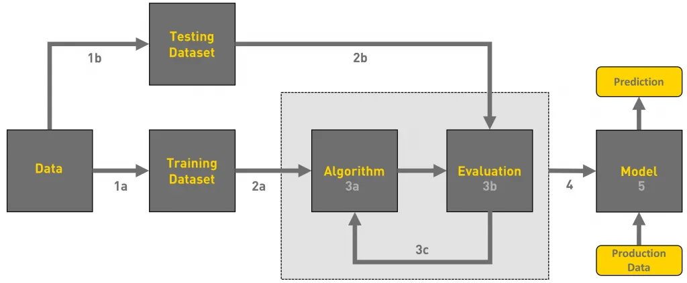
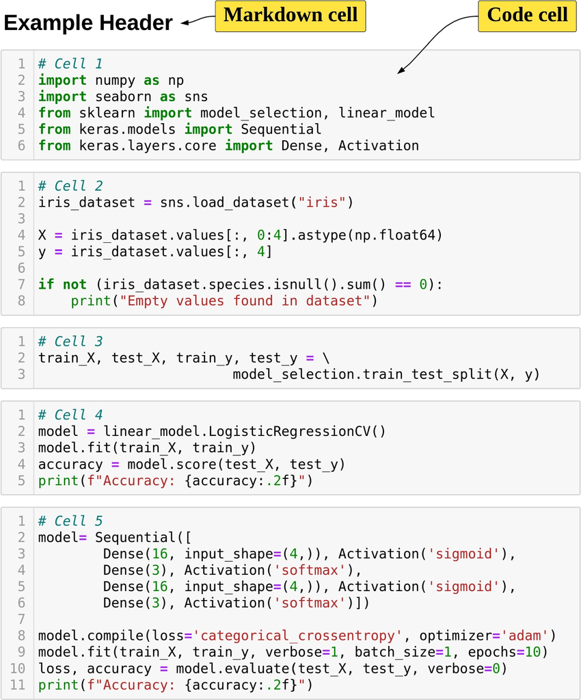

+++

title = "Structure and Automate AI Workflows with MLOps"
description = "Introduction to ML- and LLM-Ops"
outputs = ["Reveal"]

+++

{}

# Structure and Automate AI Workflows with MLOps

[Giovanni Ciatto](mailto:giovanni.ciatto@unibo.it)
  Dipartimento di Informatica — Scienza e Ingegneria (DISI), Sede di Cesena,
  Alma Mater Studiorum—Università di Bologna

<!--  -->

(versione presentazione: )

---

## Link a queste slide

<>



[<i class="fa fa-print" aria-hidden="true"></i> versione stampabile](?print-pdf&pdfSeparateFragments=false)

---



## Outline

1. Motivation and Context
    - the ML workflow
    - the GenAI workflow
    - need for MLOps, definition, expected benefits

2. MLOps with MLflow
    - API, tracking server, backend store, artifact store, setups
    - interactive usage (notebook)
    - batch usage + project setup
    - interoperability with Python libraries

3. End-to-end example for classification

4. End-to-end example for LLM agents

{}

---

## What is the _goal_ of a Machine Learning workflow?

Training a __model__ from _data_, in order to
- do __prediction__ on _unseen data_, 
    * e.g. spam filter
- or __mine__ information from it,
    * e.g. profiling customers
- or __automate__ some operation which is _hard to code_ explicitly
    * e.g. NPCs in video games

---

## What is the _outcome_ of a Machine Learning workflow?

- A __software module__ (e.g. a Python object) implementing a _mathematical function_...
    * e.g. `predict(input_data) -> output_data`

- ... commonly __tailored__ on a specific _data schema_
    * e.g. customer information + statistics about shopping history

- ... which __works__ sufficiently __well__ w.r.t. _test data_

- ... which must commonly be __integrated__ into a much larger _software system_
    * e.g. a web application, a mobile app, etc.

- ... which may need to be __re-trained__ upon _data changes_.

---

{}

## What are the _phases_ of a Machine Learning workflow?

The process of producing a ML model is __not__ _linear_ __nor__ _simple_:

* there could be __many iterations__ (up to reaching _satisfactory evaluation_)
* the whole workflow may be __re-started__ upon _data changes_
* updates in the model imply further __integration__/deployment _efforts_ in _downstream systems_

---

## Activities in a typical ML workflow

1. __Problem framing__ – define the business/technical goal.
2. __Data collection__ – acquire raw data.
3. __Data preparation__ – clean, label, and transform data.
4. __Feature engineering__ – extract useful variables from data.
5. __Model training__ – apply ML algorithms to produce candidate models.
6. __Experimentation & evaluation__ – compare models, tune hyperparameters, measure performance.
7. __Model packaging & deployment__ – turn the best model into a service or product.
8. __Monitoring & feedback__ – check performance in production, detect drift, gather new data, trigger retraining.

> These steps are cyclical, not linear → one often revisits data, retrain, or refine features.

{}

---

## How are Machine Learning workflows typically performed?

{}
{}

{}
{}
### Via Notebooks (e.g. Jupyter)

- ✅ Interleave code, textual description, and visualizations  

- ✅ Interactive usage, allowing for real-time feedback and adjustments

- ✅ Uniform & easy interface to workstations

- ✅ Easy to save, restore, and share

- ❌ Incentivises manual activities over automatic ones

{}
{}

---

## Pitfalls of manual work in notebooks

- Non-reproducibility: hidden state, out-of-order execution, forgotten seeds
- Weak provenance: params, code version, data slice, and metrics not logged
- Human-in-the-loop gating: “print accuracy → eyeball → tweak → rerun”
- Fragile artifacts: models overwritten, files named `final_v3.ipynb`
- Environment drift: “works on my machine” dependencies and data paths
- Collaboration pain: merge conflicts, opaque diffs, reviewability issues

---

## Example: why manual runs mislead

- Run 1: random split → train → print accuracy = 0.82
- Tweak hyperparams → rerun only training cell → accuracy = 0.86
- Forgot to fix seed / re-run split → different data, different metric
- No record of params, code, data; “best” model cannot be justified

Consequences:
- Incomparable results, irreproducible models
- Hard to automate, schedule, or roll back
- No trace from model → code → data → metrics

---

## Analogies among ML workflows and Software Engineering ones

* Both __produce__ _software modules_ in the end
* Both involve __iterative processes__, where _feedback_ is used to improve the product
* Both are driven by __tests__/evaluations
* Both may benefit from __automation__
    - ... and may _lose efficiency_ when activities are performed manually

---

# Talk is Over

 

Compiled on:  --- [<i class="fa fa-print" aria-hidden="true"></i> printable version](?print-pdf&pdfSeparateFragments=false)

[<i class="fa fa-undo" aria-hidden="true"></i> back to ToC](#toc)