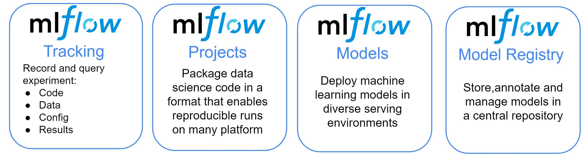

+++

title = "Structure and Automate AI Workflows with MLOps"
description = "Introduction to ML- and LLM-Ops"
outputs = ["Reveal"]

+++

{}

# Structure and Automate AI Workflows with MLOps

[Giovanni Ciatto](mailto:giovanni.ciatto@unibo.it)
<br> Dipartimento di Informatica — Scienza e Ingegneria (DISI), Sede di Cesena,
<br> Alma Mater Studiorum—Università di Bologna

<!--  -->

<span class="hint">(versione presentazione: )</span>


---

## Link a queste slide

<>



[<i class="fa fa-print" aria-hidden="true"></i> versione stampabile](?print-pdf&pdfSeparateFragments=false)

---



## Outline

1. Motivation and Context
    - the ML workflow
    - the GenAI workflow
    - need for MLOps, definition, expected benefits

2. MLOps with MLflow
    - API, tracking server, backend store, artifact store, setups
    - interactive usage (notebook)
    - batch usage + project setup
    - interoperability with Python libraries

3. End-to-end example for classification

4. End-to-end example for LLM agents

{}

---

## What is the _goal_ of a Machine Learning workflow?

Training a __model__ from _data_, in order to:
- do __prediction__ on _unseen data_, 
    * e.g. spam filter
- or __mine__ information from it,
    * e.g. profiling customers
- or __automate__ some operation which is _hard to code_ explicitly
    * e.g. NPCs in video games

---

{}

## What is a _model_ in the context of ML? (pt. 1)

In _statistics_ (and _machine learning_) a __model__ is a _mathematical representation_ of a real-world process
<br> (commonly attained by _fitting_ a parametric _function_ over a _sample_ of _data_ describing the process)


e.g.: __$f(x) = \beta_0 + \beta_1 x $__ where __$f$__ is the amount of minutes played, and __$x$__ is the age

---

## What is a _model_ in the context of ML? (pt. 2)

E.g. __neural networks__ (NN) are a popular _family_ of models

{}
{}


Single neuron
{}
{}


(Feed-forward)
<br>
Neural network $\equiv$ cascade of _layers_
{}
{}


[Many admissible architectures](https://www.asimovinstitute.org/neural-network-zoo/), serving disparate purposes
{}
{}


{}

---

## What is the _outcome_ of a Machine Learning workflow?

- A __software module__ (e.g. a Python object) implementing a _mathematical function_...
    * e.g. `predict(input_data) -> output_data`

- ... commonly __tailored__ on a specific _data schema_
    * e.g. customer information + statistics about shopping history

- ... which __works__ sufficiently __well__ w.r.t. _test data_

- ... which must commonly be __integrated__ into a much larger _software system_
    * e.g. a web application, a mobile app, etc.

- ... which may need to be __re-trained__ upon _data changes_.

---

{}

## What are the _phases_ of a Machine Learning workflow?

The process of producing a ML model is __not__ _linear_ __nor__ _simple_:


* there could be __many iterations__ (up to reaching _satisfactory evaluation_)
* the whole workflow may be __re-started__ upon _data changes_
* updates in the model imply further __integration__/deployment _efforts_ in _downstream systems_

---

## Activities in a typical ML workflow

1. __Problem framing__: define the business/technical goal
2. __Data collection__: acquire raw data
3. __Data preparation__: clean, label, and transform data
4. __Feature engineering__: extract useful variables from data
5. __Model training__: apply ML algorithms to produce candidate models
6. __Experimentation & evaluation__: compare models, tune hyperparameters, measure performance
7. __Model packaging & deployment__: turn the best model into a service or product
8. __Monitoring & feedback__: check performance in production, detect drift, gather new data, trigger retraining

> These steps are cyclical, not linear → one often revisits data, retrain, or refine features.

---

## Example of ML workflow

> Forecast footfall/visits to some office by day/time
+ useful for staffing and opening hours planning

1. __Problem framing__: model as a _regression_ task or _time-series forecasting_ task?
2. __Data collection__: gather _historical_ footfall _data_, calendar events, weather data, etc.
3. __Data preparation__: clean and preprocess data, handle missing values, etc.
4. __Feature engineering__: create _relevant features_ (e.g. day of week, holidays, weather conditions)
5. __Model training__: apply ML algorithms to _produce candidate models_
6. __Experimentation & evaluation__: _compare models_, tune hyperparameters, measure performance
7. __Model packaging & deployment__: turn the _best model_ into a _service_ or product
8. __Monitoring & feedback__: _monitor performance_ in production, detect _drifts_, gather new data, trigger _retraining_
    + new offices or online services may change footfall patterns

{}

---

## How are Machine Learning workflows typically performed?

{}
{}

{}
{}
### Via Notebooks (e.g. Jupyter)

- ✅ Interleave code, textual description, and visualizations  

- ✅ Interactive usage, allowing for real-time feedback and adjustments

- ✅ Uniform & easy interface to workstations

- ✅ Easy to save, restore, and share

- ❌ Incentivises manual activities over automatic ones

{}
{}

---

## Pitfalls of manual work in notebooks

- __Non-reproducibility__: hidden state, out-of-order execution, forgotten seeds
- __Weak provenance__: params, code version, data slice, and metrics not logged
- __Human-in-the-loop gating__: “print accuracy → eyeball → tweak → rerun”
- __Fragile artifacts__: models overwritten, files named `final_v3.ipynb`
- __Environment drift__: “works on my machine” dependencies and data paths
- __Collaboration pain__: merge conflicts, opaque diffs, reviewability issues

---

## Example: why manual runs mislead

- Run 1: random split → train → print accuracy = 0.82
- Tweak hyperparams → rerun only training cell → accuracy = 0.86
- Forgot to fix seed / re-run split → different data, different metric
- No record of params, code, data; “best” model cannot be justified

{}
### Consequences
- Incomparable results, irreproducible models
- Hard to automate, schedule, or roll back
- No trace from model → code → data → metrics
{}

---

## Comparison among ML and ordinary software projects

### Analogies

* Both __produce__ _software modules_ in the end
* Both involve __iterative processes__, where _feedback_ is used to improve the product
* Both are driven by __tests__/evaluations
* Both may benefit from __automation__
    - ... and may _lose efficiency_ when activities are performed manually

{}
### Differences

* ML projects depend on _data_ (which _changes_ over time)
* Models need _training_ and _retraining_, not just coding
* Performance may _degrade_ in production (data drift, bias, new environments)
* Many _different expertises_ are involved (data engineers, software engineers, domain experts, operations)
{}

{}
> No structured process $\implies$ ML projects may fail to move from notebooks to real-world use
{}

--- 

## Machine Learning Operations ([MLOps](https://en.wikipedia.org/wiki/MLOps))

> The practice of organizing and __automating__ the _end-to-end_ process of building, training, deploying, and maintaining _machine-learning models_

{}
### Expected benefits 

- __Reproducibility__ → the same code + same data always gives the same model
- __Automation__ → repetitive steps (training, testing, deployment) are handled by pipelines
- __Scalability__ → easier to scale up the training process to more data, bigger models, or more computing resources
- __Monitoring & governance__ → models are tracked, evaluated, and kept under control
- __Collaboration__ → teams work on shared infrastructure, with clear responsibilities
- __Versioning__ → models, data, and code are versioned and traceable

{}

---

## How does MLOps support ML practitioners

MLOps adds _infrastructure_ + _processes_ + _automation_ to make each step more reliable:
- __Data__ → _version control_ for datasets, metadata, lineage tracking
- __Training__ → _automated pipelines_ that reproduce experiments on demand
- __Evaluation__ → _systematic tracking_ of metrics, logs, and artifacts
- __Deployment__ → continuous integration & delivery (_CI/CD_) for ML models, often with _model registries_
- __Monitoring__ → _automated checks_ for performance, drift, fairness, anomalies
- __Collaboration__ → _shared repositories_, environments, and documentation so teams can work together

---

## What may happen __without__ MLOps

- __Data__ in _ad-hoc spreadsheets_ or _local files_ (no version control)
- __Training__ in _personal notebooks_ (hard to reproduce later)
- __Model evaluation__ is _manual_ and _undocumented_ (hard to compare results)
- __Deployment__ = _copy-paste_ code or manual sharing of a _model file_
- __Monitoring__ is much harder → _models silently degrade_
- __Collaboration__ = `“send me your notebook by email”`

{}
### Consequences

- ❌ Fragile, non-reproducible workflows
- ❌ Long delays when models need updating
- ❌ Difficulty scaling beyond a single researcher
- ❌ Low trust from stakeholders (“why did accuracy drop?”)
{}

---

# What about Generative AI workflows?

---

## What is the _goal_ of a Generative AI workflow?

Engineering _prompts_, _tools_, _vector stores_, and _agents_ to constrain and govern the behavior of __pre-trained__ (_foundation_) models, in order to:
- __generate__ contents (text, images, code, etc.) for a specific purpose
    * e.g. bring unstructured data into a particular format
    * e.g. produce summaries, reports, highlights
- __interpret__ unstructured data and _grasp information_ from it
    * e.g. extract entities, relations, sentiments
    * e.g. answer questions about a document
- __automate__ data-processing tasks which are _hard to code_ explicitly
    * e.g. the task is ill-defined (`write an evaluation paragraph for each student's work`)
    * e.g. the task requires mining information from unstructured data (`find the parties involved in this contract`)
    * e.g. the task is complex yet too narrow to allow for general purpose coding (`plan a vacation itinerary based on user preferences`)
- __interact__ with users via _natural language_
    * e.g. chatbots, virtual assistants

---

## Let's explain the nomenclature

- __Pre-trained <u>foundation</u> models__ (PFM): large neural-networks trained on massive datasets to learn general skills (e.g. 'understanding' and generating text, images, code)
    * e.g. GPT, PaLM, LLaMA, etc.

- __Prompts__: carefully _crafted textual inputs_ that guide some PFM to produce _desired outputs_
    * prompt __templates__ are prompts with _named placeholders_ to be filled with specific data at runtime
        + e.g. `Write a summary of the following article: {article_text}`

- __Tools__: external _software components_ (e.g. APIs, databases, search engines) that can be _invoked_ by PFMs to perform specific tasks or retrieve information
    * e.g. a calculator API, a weather API, a database query interface

- __Vector stores__: specialized databases that store and retrieve _high-dimensional vectors_ (embeddings) for the sake of _information retrieval_ via _similarity search_
    * e.g. to support _retrieval-augmented generation_ (RAG)

- __Agents__: software systems that _orchestrate_ the interaction between PFMs and tools, enabling dynamic decision-making and task execution based on the context and user input
    * e.g. a chatbot that uses a PFM for conversation and invokes a weather API when asked about the weather
    * e.g. an assistant that uses a PFM to understand user requests and a database to fetch relevant information

---

## What are the _outcomes_ of a Generative AI workflow?

0. FM are commonly <u>not</u> produced in-house, but rather _accessed_ via APIs... yet the choice of __what model(s) to use__ is crucial
    * must be available, configured, and most commonly imply _costs_ (per call, per token, etc.)

1. A set of __prompt templates__ (text files, or code snippets) that are known to work well for the tasks at hand
    * commonly assessed via semi-automatic _evaluations_ on a _validation set_ of inputs

2. A set of __tool servers__ implementing the [MCP protocol](https://modelcontextprotocol.io/docs/getting-started/intro) so that tools can be _invoked_ by PFMs
    * these are _software modules_, somewhat similar to ordinary Web services, offering one endpoint per tool

3. A set of __agents__, implementing the logic to orchestrate the interaction between PFMs and tools
    * these are _software modules_, commonly implemented via libraries such as [LangChain](https://python.langchain.com/en/latest/index.html) or [LlamaIndex](https://gpt-index.readthedocs.io/en/latest/)

4. A set of __vector stores__ (if needed), populated with relevant data, and accessible by the agents
    * there are _software modules_, somewhat similar to ordinary DBMS, offering CRUD operations on data chunks _indexed by_ their _embeddings_
    
---

{}

## What are the _phases_ of a GenAI workflow?

(Similar to the ML workflow in the sense that the goal is to process data, but different in many details e.g. _no training_ is involved)


* there could be __many iterations__ (e.g. for PFM selection, and prompt tuning)
* the whole workflow may be __re-started__ upon _data changes_, or _task changes_, or new _PFM availability_
* the __interplay__ between prompts, models, tasks, and data may need to be _monitored_ and _adjusted_ continuously
* the __data-flow__ between components (agents, PFM, tools, vector stores) may need to be _tracked_ for the sake of _debugging_ and _monitoring_

---

## Peculiar activities in a typical GenAI workflow

1. __Foundation model selection__: choose the most suitable pre-trained model(s) based on task requirements, performance, cost, data protection, and availability 
    * implies trying out prompts (even manually) on different models

2. __Prompt engineering__: design, test, and refine prompt templates to elicit the desired responses
    * implies engineering variables, lengths, formats, contents, etc

3. __Evaluations__: establish assertions and metrics to assess PFM responses to prompts (attained by instantiating templates over actual data)
    * somewhat similar to _unit tests_ in ordinary software
    * important when automatic, as they allow quick evaluations on prompt/model combinations

4. __Tracking__ the _data-flow_ between components (agents, PFM, tools, vector stores) to monitor _costs_, _latency_, and to _debug_ unexpected behaviors
    * also useful for the sake of _auditing_ and _governance_

---

## Example of GenAI workflow (pt. 1)

> Support public officers in managing tenders through a GenAI assistant that understands and compares procurement decisions transparently.

1. __Problem Framing__:
    - _Content Generation_: draft and justify _comparisons_ among suppliers’ offers vs. technical specs
    - _Interpretation_: understand regulatory documents and technical language
    - _Automation_: retrieve relevant laws, norms, and prior tender examples
    - _Interaction_: enable officers to query and validate results through natural language

2. __Data Collection__: past tenders' technical specifications, acts, etc; regulatory documents, etc.

3. __Data Preparation__: 
    - devise useful data schema & extract relevant data from documents
    - anonymize sensitive info (suppliers, personal data)
    - segment documents and index by topic (law, SLA, price table, etc.)

---

## Example of GenAI workflow (pt. 2)

4. __Prompt Engineering__: 
    1. design prompt templates for comparison, justification, and Q&A
        * use role-based system prompts (`You are a procurement evaluator…`)
    2. allocate placeholders for RAG-retrieved data chunks
    3. iterate on template design based on manual tests

5. __Foundation Model Selection__: multi-lingual? specialized in legal/technical text? cost constraints? support for tools?

6. __Vector stores__: storing embeddings for tender documents & specs, legal texts & guidelines, previous evaluation, templates
    1. choose embedding model, chunking strategy, and populate vector store
    2. engineer retrieval strategies to fetch relevant chunks

8. __Tools__: 
    * regulation lookup API + tender database query API
    * report generation out of document templates
    * automate scoring calculations via spreadsheet or Python scripts generation

9. __Agents__: 
    1. exploit LLM to extract structured check-lists out of technical specs
    2. orchestrate RAG, tool invocations, and prompt templates to score each offer
    3. generate comparison reports 
    4. ...

{}

---

## LLM Operations ([LLMOps](https://www.databricks.com/it/glossary/llmops))

> The practice of organizing and __automating__ the _end-to-end_ process of building, evaluating, deploying, and maintaining _GenAI applications_

<br>

{}
####  In a nutshell: __MLOps for GenAI__
{}

<br>

{}
### Expected benefits 

- __Systematicity__ → structured processes to manage prompts, tools, and agents
- __Efficiency__ → reuse of components, templates, and evaluations
- __Scalability__ → easier to test, and update individual components (prompt templates, tools, agents)
- __Monitoring & governance__ → components are tracked, evaluated, and kept under control

{}

---

## How does LLMOps support GenAI practitioners

LLOps adds _infrastructure_ + _processes_ + _automation_ to make each step more reliable:
- __Foundation models__ → _catalogs_ of available models, with metadata on capabilities, costs, and usage policies
- __Provider Gateways__ → standardized APIs to access different PFM providers (e.g. OpenAI, HuggingFace) uniformly, without code rewrites
- __Prompt engineering__ → _version control_ for prompt templates, systematic testing frameworks
- __Tool integration__ → _standardized protocols_ (e.g. MCP) and libraries to connect tools with PFMs + _gateway technologies_ to aggregate multiple tools
- __Agents__ → _provider-agnostic libraries_ and frameworks (e.g. LangChain) to build, manage, and orchestrate agents
- __Vector stores__ → _standardized interfaces_ to store and retrieve data chunks via embeddings, with support for _multiple backend_ DBMS
- __Evaluation & monitoring__ → _automated_ frameworks to run _evaluations_, _track performance_, and _monitor costs_

---

## What may happen __without__ LLMOps

- __Foundation models__ are _hard-coded_ in the application
    * making it difficult to switch providers or models

- __Prompt templates__ are _scattered_ in code or documents
    * making it hard to track changes or reuse them

- __Tools__ are _manually integrated_, leading to:
    * brittle connections, 
    * lack of observability, 
    * maintenance challenges

- __Agents__ are _ad-hoc scripts_ that mix logic, PFM calls, and tool invocations
    * making them hard to debug, extend or compose

- __Vector stores__ are _tightly coupled_ with specific DBMS
    * making it hard to migrate or scale

- __Evaluation & monitoring__ are _manual_ and _sporadic_ leading to undetected issues, cost overruns, and loss of trust

---

# MLOps and LLMOps with [MLflow](https://mlflow.org/)

---

## What is MLflow? <https://mlflow.org/>

 

> An _open-source_ Python framework for __MLOps__ and (most recently) __LLMOps__
* usable either in-cloud (e.g. via [Databricks](https://www.databricks.com/)) or on-premises (self-hosted)
    + we'll see the latter setup

{}
### Outline 

1. First, we focus on how to use MLflow for the sake of _MLOps_
2. Then, we show how MLflow can be used for _LLMOps_ as well

{}

---

## MLflow for MLOps: main components pt. 1


{}
{}
### Provides

- _UI_ to visualize and monitor experiments
- Facilities to _evaluate_ ML models (metrics and charts)
- Python API and command-line support for _ML operations_
{}
{}
### How

- by _tracking_ metadata about datasets, experiments, and models
- by _serializing_ and _storing_ models, charts, predictions, metrics, etc.
- by facilitating _deployment_ of models _as services_

{}
{}

---

## MLflow for MLOps: main components pt. 2



---

## MLflow's common set-ups


{}
{}
1. Solo development (serverless)
{}
{}
2. Solo development (local server + remote store)
{}
{}
3. Team work (remote server)
{}
{}

---

## MLflow's complex set-up

Notice that, in set-up 3, there could be up to three servers involved:

1. the __Backend Store__ server (a relational DBMS, e.g. PostgreSQL, MySQL, SQLite, etc.) to store _metadata_
2. the __Artifact Store__ server (e.g. S3, Azure Blob Storage, etc.) to store _artifacts_ via some file-system interface
3. the __MLflow Tracking Server__ to provide the UI and API endpoints 
    + this is mediating the interaction between users and the two stores
---

## MLflow's functioning overview

### Assumptions

1. Some Python code is in place to perform ML tasks (via common libraries such as `scikit-learn`, `TensorFlow`, `PyTorch`, etc.)
2. The code is using the MLflow Python API to log metadata about experiments, datasets, models, metrics, etc.

{}
### Workflow

0. Start the Python code

1. The MLflow Python API invoked in the code will actually log all relevant _metadata_ and _artifacts_ as the code runs
    - __metadata__ $\approx$ experiment id, run id, timings, data schemas, input parameters, hyper-parameters, metric values, etc.
    - __artifact__ $\approx$ dataset, model, chart, etc.

2. Metadata and artifacts may be stored (depending on the configuration):
    - on the local file system 
    - on a remote backend and artifact store

{}

---

## MLflow usage remarks

- __Assumption 2__ may require additional effort from the developer(s)
    + this is kept minimal via [auto-logging](https://mlflow.org/docs/3.3.1/ml/tracking/autolog/) available for most common ML libraries

- __No big constraint__ on how to organize the Python code it-self...


- ... but many __benefits__ (_automatization_, reproducibility) may come from organizing the code as an [MLflow Project](https://mlflow.org/docs/latest/ml/projects/)
    + $\implies$ _decomposing_ the _code_ into multiple scripts
    + $\implies$ thinking about the _parametric aspects_ of the experiment, and account for _command-line arguments_ accordingly
    + $\implies$ thinking about the _environment_ where the code will run (e.g. dependencies, libraries, etc.)
    + we'll see this aspect later

---

{}

## A taste of MLflow's Tracking API (pt. 1)

1. Install MLflow into your Python environment
    ```bash
    pip install mlflow
    ```

2. Consider the following dummy script:
    ```python
    import sys # to read command-line arguments
    import tempfile # to save generated files into temporary directories
    import mlflow # to use MLflow functionalities
    from random import Random # to generate random numbers with controlled seed

    # Set the experiment name (creates it if it does not exist)
    mlflow.set_experiment(experiment_name="logging_example")
    # Read a seed from command-line arguments (default: 42)
    seed = int(sys.argv[1]) if len(sys.argv) > 1 else 42
    rand = Random(seed)
    # Start an MLflow run, naming it "example_run" (otherwise random name is generated)
    with mlflow.start_run(run_name="example_run") as run:
        # notice that experiments are runs are identified by their numeric IDs
        print(f"Started MLflow run with ID: {run.info.run_id} in experiment ID: {run.info.experiment_id}")
        # Log a parameter "seed" with the given seed value
        mlflow.log_param("seed", seed)
        # Let's simulate 5 different metric scores to be logged
        for i in range(5):
            mlflow.log_metric(f"random_{i}", rand.random())
        mlflow.log_metric("random_4", rand.randint(1, 10)) # overwrite last metric
        # Create and log an example artifact (a text file, generated inside temporaty directory)
        with tempfile.TemporaryDirectory() as tmpdir:
            file_path = f"{tmpdir}/example.txt"
            with open(file_path, "w") as f:
                f.write("This is an example artifact.")
            mlflow.log_artifact(file_path, artifact_path="examples")
        # Simulate an error in the run if the seed parameter is odd
        if seed % 2 == 1:
            raise ValueError("Let the run fail for odd seeds!")
        print("Run completed successfully.")
    ```

--- 

## A taste of MLflow's Tracking API (pt. 2)

3. Let's run the experiment _twice_, with __different seeds__:
    ```bash
    python logging_example.py 42
    python logging_example.py 43
    ```

4. The __1st__ _successful_ run shall output something like:
    ```text
    2025/11/10 11:44:49 INFO mlflow.tracking.fluent: Experiment with name 'logging_example' does not exist. Creating a new experiment.
    Started MLflow run with ID: 378f18735f6d4abd8abeba76f4029bea in experiment ID: 931233098002846893
    ```

5. The __2nd__ _failing_ run shall output something like:
    ```text
    Started MLflow run with ID: 9b52b7b7416e423ca9c878fba9b5c667 in experiment ID: 931233098002846893
    Traceback (most recent call last):
    File "/home/gciatto/Work/Code/example-mlops/mlflow_tracking.py", line 28, in <module>
        raise ValueError("Let the run fail for odd seeds!")
    ValueError: Let the run fail for odd seeds!
    ```

6. Look at your file system, notice that a new `mlruns/` folder has appeared next to Python script:
    ```text
    mlruns
    ├── 931233098002846893
    │   ├── 378f18735f6d4abd8abeba76f4029bea
    │   │   ├── artifacts
    │   │   │   └── examples
    │   │   │       └── example.txt
    │   │   ├── meta.yaml
    │   │   ├── metrics
    │   │   │   ├── random_0
    │   │   │   ├── random_1
    │   │   │   ├── random_2
    │   │   │   ├── random_3
    │   │   │   └── random_4
    │   │   ├── params
    │   │   │   └── seed
    │   │   └── tags
    │   │       ├── mlflow.runName
    │   │       ├── mlflow.source.git.commit
    │   │       ├── mlflow.source.name
    │   │       ├── mlflow.source.type
    │   │       └── mlflow.user
    │   ├── 9b52b7b7416e423ca9c878fba9b5c667
    │   │   ├── artifacts
    │   │   │   └── examples
    │   │   │       └── example.txt
    │   │   ├── meta.yaml
    │   │   ├── metrics
    │   │   │   ├── random_0
    │   │   │   ├── random_1
    │   │   │   ├── random_2
    │   │   │   ├── random_3
    │   │   │   └── random_4
    │   │   ├── params
    │   │   │   └── seed
    │   │   └── tags
    │   │       ├── mlflow.runName
    │   │       ├── mlflow.source.git.commit
    │   │       ├── mlflow.source.name
    │   │       ├── mlflow.source.type
    │   │       └── mlflow.user
    │   ├── meta.yaml
    │   └── tags
    │       └── mlflow.experimentKind
    └── models
    ```

--- 

## A taste of MLflow's Tracking API (pt. 3)

7. Let's now start the __MLflow Web UI__ via the following command, to _visualize_ the experiment runs:
    ```bash
    mlflow ui
    ```

    then browse to <http://127.0.0.1:5000> in your favorite browser

8. You should see something like the following:
    

--- 

## A taste of MLflow's Tracking API (pt. 4)

9. Click on the __experiment name__ (`logging_example`) to see the two runs:
    
    - notice that the _latest_ run is marked as __failing__ while the earliest one is successful 
        + the __exit code__ of the run is registered automatically

--- 

## A taste of MLflow's Tracking API (pt. 5)

10. You may switch to the __"Chart view"__ to see a _comparison_ among the logged _metrics_ (across all runs):
    

--- 

## A taste of MLflow's Tracking API (pt. 6)

11. You may click on one __run name__ to see details about that run
    
    - notice the logged _parameters_, _metrics_, and _metadata_
        * notice that these are the same information we logged via the MLflow Python API + some automatically-inferred metadata
    - notice that these data are the same one stored on the file system, in `mlruns/`

---

## A taste of MLflow's Tracking API (pt. 7)

12. You may switch to the __"Modal metrics"__ tab to see the logged metrics in graphical form:
    

---

## A taste of MLflow's Tracking API (pt. 8)

13. You may switch to the __"Artifacts"__ tab to see the logged artifacts:
    
    - notice that the `example.txt` artifact is inside some "virtual" `examples/` folder
        + as we asked explicitly in the Python code

{}

---

{}

## Autologging APIs

1. Consider the following script, aimed at training a [decision tree classifier](https://scikit-learn.org/stable/modules/tree.html) for the [Iris dataset](https://it.wikipedia.org/wiki/Dataset_Iris), via [SciKit-Learn library](https://scikit-learn.org)
    ```python
    from sklearn.datasets import load_iris # to load the iris dataset
    from sklearn.tree import DecisionTreeClassifier # to use decision tree classifier
    import mlflow # to use MLflow functionalities
    import sys # to read command-line arguments
    # Set the experiment name (creates it if it does not exist)
    mlflow.set_experiment("autologging-example")
    # Enable autologging for scikit-learn (and other ML libraries in general)
    mlflow.autolog(log_datasets=True, log_models=True, log_model_signatures=True, log_input_examples=True)
    # Read a seed from command-line arguments (default: 42)
    seed = int(sys.argv[1]) if len(sys.argv) > 1 else 42
    # Start an MLflow run, naming it "autologging_run"
    with mlflow.start_run(run_name="autologging_run"):
        # Load full iris dataset
        X, y = load_iris(return_X_y=True)

        # Train model on the entire dataset (using the given seed)
        model = DecisionTreeClassifier(random_state=seed)
        model.fit(X, y)
        # Evaluate model on the entire dataset (training accuracy)
        training_score = model.score(X, y)
        print("Training accuracy:", training_score)
        # Raise an error if training accuracy is below 90%
        if training_score < 0.9:
            raise ValueError("Training accuracy is too low: " + str(training_score))
    ```

{}

---

# Talk is Over

<br>

Compiled on:  --- [<i class="fa fa-print" aria-hidden="true"></i> printable version](?print-pdf&pdfSeparateFragments=false)

[<i class="fa fa-undo" aria-hidden="true"></i> back to ToC](#toc)