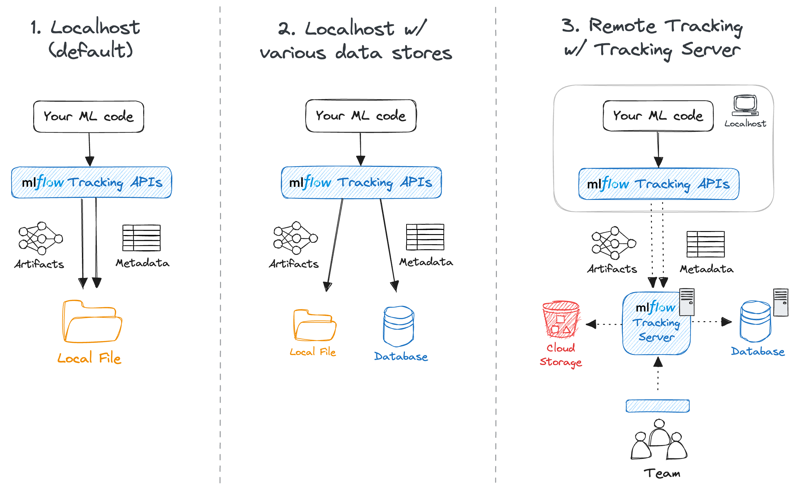

+++

title = "Structure and Automate AI Workflows with MLOps"
description = "Introduction to ML- and LLM-Ops"
outputs = ["Reveal"]

+++

{}

# Structure and Automate AI Workflows with MLOps and LLMOps

[Giovanni Ciatto](mailto:giovanni.ciatto@unibo.it)
<br> Dipartimento di Informatica — Scienza e Ingegneria (DISI), Sede di Cesena,
<br> Alma Mater Studiorum—Università di Bologna

<!--  -->

<span class="hint">(version: )</span>


---

## Link to these slides

<>



[<i class="fa fa-print" aria-hidden="true"></i> printable version](?print-pdf&pdfSeparateFragments=false)

---



## Outline

1. Motivation and Context
    - the ML workflow
    - the GenAI workflow
    - need for MLOps, definition, expected benefits

2. MLOps with MLflow
    - API, tracking server, backend store, artifact store, setups
    - interactive usage (notebook)
    - batch usage + project setup
    - interoperability with Python libraries

3. End-to-end example for classification

4. End-to-end example for LLM agents

{}

---

## What is the _goal_ of a Machine Learning workflow?

Training a __model__ from _data_, in order to:
- do __prediction__ on _unseen data_,
    * e.g. spam filter
- or __mine__ information from it,
    * e.g. profiling customers
- or __automate__ some operation which is _hard to code_ explicitly
    * e.g. NPCs in video games

---

{}

## What is a _model_ in the context of ML? (pt. 1)

In _statistics_ (and _machine learning_) a __model__ is a _mathematical representation_ of a real-world process
<br> (commonly attained by _fitting_ a parametric _function_ over a _sample_ of _data_ describing the process)


e.g.: __$f(x) = \beta_0 + \beta_1 x $__ where __$f$__ is the amount of minutes played, and __$x$__ is the age

---

## What is a _model_ in the context of ML? (pt. 2)

E.g. __neural networks__ (NN) are a popular _family_ of models

{}
{}


Single neuron
{}
{}


(Feed-forward)
<br>
Neural network $\equiv$ cascade of _layers_
{}
{}


[Many admissible architectures](https://www.asimovinstitute.org/neural-network-zoo/), serving disparate purposes
{}
{}


{}

---

## What is the _outcome_ of a Machine Learning workflow?

- A __software module__ (e.g. a Python object) implementing a _mathematical function_...
    * e.g. `predict(input_data) -> output_data`

- ... commonly __tailored__ on a specific _data schema_
    * e.g. customer information + statistics about shopping history

- ... which __works__ sufficiently __well__ w.r.t. _test data_

- ... which must commonly be __integrated__ into a much larger _software system_
    * e.g. a web application, a mobile app, etc.

- ... which may need to be __re-trained__ upon _data changes_.

---

{}

## What are the _phases_ of a Machine Learning workflow?

The process of producing a ML model is __not__ _linear_ __nor__ _simple_:


* there could be __many iterations__ (up to reaching _satisfactory evaluation_)
* the whole workflow may be __re-started__ upon _data changes_
* updates in the model imply further __integration__/deployment _efforts_ in _downstream systems_

---

## Activities in a typical ML workflow

1. __Problem framing__: define the business/technical goal
2. __Data collection__: acquire raw data
3. __Data preparation__: clean, label, and transform data
4. __Feature engineering__: extract useful variables from data
5. __Model training__: apply ML algorithms to produce candidate models
6. __Experimentation & evaluation__: compare models, tune hyperparameters, measure performance
7. __Model packaging & deployment__: turn the best model into a service or product
8. __Monitoring & feedback__: check performance in production, detect drift, gather new data, trigger retraining

> These steps are cyclical, not linear → one often revisits data, retrain, or refine features.

---

## Example of ML workflow

> Forecast footfall/visits to some office by day/time
+ useful for staffing and opening hours planning

1. __Problem framing__: model as a _regression_ task or _time-series forecasting_ task?
2. __Data collection__: gather _historical_ footfall _data_, calendar events, weather data, etc.
3. __Data preparation__: clean and preprocess data, handle missing values, etc.
4. __Feature engineering__: create _relevant features_ (e.g. day of week, holidays, weather conditions)
5. __Model training__: apply ML algorithms to _produce candidate models_
6. __Experimentation & evaluation__: _compare models_, tune hyperparameters, measure performance
7. __Model packaging & deployment__: turn the _best model_ into a _service_ or product
8. __Monitoring & feedback__: _monitor performance_ in production, detect _drifts_, gather new data, trigger _retraining_
    + new offices or online services may change footfall patterns

{}

---

## How are Machine Learning workflows typically performed?

{}
{}

{}
{}
### Via Notebooks (e.g. Jupyter)

- ✅ Interleave code, textual description, and visualizations

- ✅ Interactive usage, allowing for real-time feedback and adjustments

- ✅ Uniform & easy interface to workstations

- ✅ Easy to save, restore, and share

- ❌ Incentivises manual activities over automatic ones

{}
{}

---

## Pitfalls of manual work in notebooks

- __Non-reproducibility__: hidden state, out-of-order execution, forgotten seeds
- __Weak provenance__: params, code version, data slice, and metrics not logged
- __Human-in-the-loop gating__: “print accuracy → eyeball → tweak → rerun”
- __Fragile artifacts__: models overwritten, files named `final_v3.ipynb`
- __Environment drift__: “works on my machine” dependencies and data paths
- __Collaboration pain__: merge conflicts, opaque diffs, reviewability issues

---

## Example: why manual runs mislead

- Run 1: random split → train → print accuracy = 0.82
- Tweak hyperparams → rerun only training cell → accuracy = 0.86
- Forgot to fix seed / re-run split → different data, different metric
- No record of params, code, data; “best” model cannot be justified

{}
### Consequences
- Incomparable results, irreproducible models
- Hard to automate, schedule, or roll back
- No trace from model → code → data → metrics
{}

---

## Comparison among ML and ordinary software projects

### Analogies

* Both __produce__ _software modules_ in the end
* Both involve __iterative processes__, where _feedback_ is used to improve the product
* Both are driven by __tests__/evaluations
* Both may benefit from __automation__
    - ... and may _lose efficiency_ when activities are performed manually

{}
### Differences

* ML projects depend on _data_ (which _changes_ over time)
* Models need _training_ and _retraining_, not just coding
* Performance may _degrade_ in production (data drift, bias, new environments)
* Many _different expertises_ are involved (data engineers, software engineers, domain experts, operations)
{}

{}
> No structured process $\implies$ ML projects may fail to move from notebooks to real-world use
{}

---

## Machine Learning Operations ([MLOps](https://en.wikipedia.org/wiki/MLOps))

> The practice of organizing and __automating__ the _end-to-end_ process of building, training, deploying, and maintaining _machine-learning models_

{}
### Expected benefits

- __Reproducibility__ → the same code + same data always gives the same model
- __Automation__ → repetitive steps (training, testing, deployment) are handled by pipelines
- __Scalability__ → easier to scale up the training process to more data, bigger models, or more computing resources
- __Monitoring & governance__ → models are tracked, evaluated, and kept under control
- __Collaboration__ → teams work on shared infrastructure, with clear responsibilities
- __Versioning__ → models, data, and code are versioned and traceable

{}

---

## How does MLOps support ML practitioners

MLOps adds _infrastructure_ + _processes_ + _automation_ to make each step more reliable:
- __Data__ → _version control_ for datasets, metadata, lineage tracking
- __Training__ → _automated pipelines_ that reproduce experiments on demand
- __Evaluation__ → _systematic tracking_ of metrics, logs, and artifacts
- __Deployment__ → continuous integration & delivery (_CI/CD_) for ML models, often with _model registries_
- __Monitoring__ → _automated checks_ for performance, drift, fairness, anomalies
- __Collaboration__ → _shared repositories_, environments, and documentation so teams can work together

---

## What may happen __without__ MLOps

- __Data__ in _ad-hoc spreadsheets_ or _local files_ (no version control)
- __Training__ in _personal notebooks_ (hard to reproduce later)
- __Model evaluation__ is _manual_ and _undocumented_ (hard to compare results)
- __Deployment__ = _copy-paste_ code or manual sharing of a _model file_
- __Monitoring__ is much harder → _models silently degrade_
- __Collaboration__ = `“send me your notebook by email”`

{}
### Consequences

- ❌ Fragile, non-reproducible workflows
- ❌ Long delays when models need updating
- ❌ Difficulty scaling beyond a single researcher
- ❌ Low trust from stakeholders (“why did accuracy drop?”)
{}

---

# What about Generative AI workflows?

---

## What is the _goal_ of a Generative AI workflow?

Engineering _prompts_, _tools_, _vector stores_, and _agents_ to constrain and govern the behavior of __pre-trained__ (_foundation_) models, in order to:
- __generate__ contents (text, images, code, etc.) for a specific purpose
    * e.g. bring unstructured data into a particular format
    * e.g. produce summaries, reports, highlights
- __interpret__ unstructured data and _grasp information_ from it
    * e.g. extract entities, relations, sentiments
    * e.g. answer questions about a document
- __automate__ data-processing tasks which are _hard to code_ explicitly
    * e.g. the task is ill-defined (`write an evaluation paragraph for each student's work`)
    * e.g. the task requires mining information from unstructured data (`find the parties involved in this contract`)
    * e.g. the task is complex yet too narrow to allow for general purpose coding (`plan a vacation itinerary based on user preferences`)
- __interact__ with users via _natural language_
    * e.g. chatbots, virtual assistants

---

## Let's explain the nomenclature

- __Pre-trained <u>foundation</u> models__ (PFM): large neural-networks trained on massive datasets to learn general skills (e.g. 'understanding' and generating text, images, code)
    * e.g. GPT, PaLM, LLaMA, etc.

- __Prompts__: carefully _crafted textual inputs_ that guide some PFM to produce _desired outputs_
    * prompt __templates__ are prompts with _named placeholders_ to be filled with specific data at runtime
        + e.g. `Write a summary of the following article: {article_text}`

- __Tools__: external _software components_ (e.g. APIs, databases, search engines) that can be _invoked_ by PFMs to perform specific tasks or retrieve information
    * e.g. a calculator API, a weather API, a database query interface

- __Vector stores__: specialized databases that store and retrieve _high-dimensional vectors_ (embeddings) for the sake of _information retrieval_ via _similarity search_
    * e.g. to support _retrieval-augmented generation_ (RAG)

- __Agents__: software systems that _orchestrate_ the interaction between PFMs and tools, enabling dynamic decision-making and task execution based on the context and user input
    * e.g. a chatbot that uses a PFM for conversation and invokes a weather API when asked about the weather
    * e.g. an assistant that uses a PFM to understand user requests and a database to fetch relevant information

---

## What are the _outcomes_ of a Generative AI workflow?

0. FM are commonly <u>not</u> produced in-house, but rather _accessed_ via APIs... yet the choice of __what model(s) to use__ is crucial
    * must be available, configured, and most commonly imply _costs_ (per call, per token, etc.)

1. A set of __prompt templates__ (text files, or code snippets) that are known to work well for the tasks at hand
    * commonly assessed via semi-automatic _evaluations_ on a _validation set_ of inputs

2. A set of __tool servers__ implementing the [MCP protocol](https://modelcontextprotocol.io/docs/getting-started/intro) so that tools can be _invoked_ by PFMs
    * these are _software modules_, somewhat similar to ordinary Web services, offering one endpoint per tool

3. A set of __agents__, implementing the logic to orchestrate the interaction between PFMs and tools
    * these are _software modules_, commonly implemented via libraries such as [LangChain](https://python.langchain.com/en/latest/index.html) or [LlamaIndex](https://gpt-index.readthedocs.io/en/latest/)

4. A set of __vector stores__ (if needed), populated with relevant data, and accessible by the agents
    * there are _software modules_, somewhat similar to ordinary DBMS, offering CRUD operations on data chunks _indexed by_ their _embeddings_

---

{}

## What are the _phases_ of a GenAI workflow?

(Similar to the ML workflow in the sense that the goal is to process data, but different in many details e.g. _no training_ is involved)


* there could be __many iterations__ (e.g. for PFM selection, and prompt tuning)
* the whole workflow may be __re-started__ upon _data changes_, or _task changes_, or new _PFM availability_
* the __interplay__ between prompts, models, tasks, and data may need to be _monitored_ and _adjusted_ continuously
* the __data-flow__ between components (agents, PFM, tools, vector stores) may need to be _tracked_ for the sake of _debugging_ and _monitoring_

---

## Peculiar activities in a typical GenAI workflow

1. __Foundation model selection__: choose the most suitable pre-trained model(s) based on task requirements, performance, cost, data protection, and availability
    * implies trying out prompts (even manually) on different models

2. __Prompt engineering__: design, test, and refine prompt templates to elicit the desired responses
    * implies engineering variables, lengths, formats, contents, etc

3. __Evaluations__: establish assertions and metrics to assess PFM responses to prompts (attained by instantiating templates over actual data)
    * somewhat similar to _unit tests_ in ordinary software
    * important when automatic, as they allow quick evaluations on prompt/model combinations

4. __Tracking__ the _data-flow_ between components (agents, PFM, tools, vector stores) to monitor _costs_, _latency_, and to _debug_ unexpected behaviors
    * also useful for the sake of _auditing_ and _governance_

---

## Example of GenAI workflow (pt. 1)

> Support public officers in managing tenders through a GenAI assistant that understands and compares procurement decisions transparently.

1. __Problem Framing__:
    - _Content Generation_: draft and justify _comparisons_ among suppliers’ offers vs. technical specs
    - _Interpretation_: understand regulatory documents and technical language
    - _Automation_: retrieve relevant laws, norms, and prior tender examples
    - _Interaction_: enable officers to query and validate results through natural language

2. __Data Collection__: past tenders' technical specifications, acts, etc; regulatory documents, etc.

3. __Data Preparation__:
    - devise useful data schema & extract relevant data from documents
    - anonymize sensitive info (suppliers, personal data)
    - segment documents and index by topic (law, SLA, price table, etc.)

---

## Example of GenAI workflow (pt. 2)

4. __Prompt Engineering__:
    1. design prompt templates for comparison, justification, and Q&A
        * use role-based system prompts (`You are a procurement evaluator…`)
    2. allocate placeholders for RAG-retrieved data chunks
    3. iterate on template design based on manual tests

5. __Foundation Model Selection__: multi-lingual? specialized in legal/technical text? cost constraints? support for tools?

6. __Vector stores__: storing embeddings for tender documents & specs, legal texts & guidelines, previous evaluation, templates
    1. choose embedding model, chunking strategy, and populate vector store
    2. engineer retrieval strategies to fetch relevant chunks

8. __Tools__:
    * regulation lookup API + tender database query API
    * report generation out of document templates
    * automate scoring calculations via spreadsheet or Python scripts generation

9. __Agents__:
    1. exploit LLM to extract structured check-lists out of technical specs
    2. orchestrate RAG, tool invocations, and prompt templates to score each offer
    3. generate comparison reports
    4. ...

{}

---

## LLM Operations ([LLMOps](https://www.databricks.com/it/glossary/llmops))

> The practice of organizing and __automating__ the _end-to-end_ process of building, evaluating, deploying, and maintaining _GenAI applications_

<br>

{}
####  In a nutshell: __MLOps for GenAI__
{}

<br>

{}
### Expected benefits

- __Systematicity__ → structured processes to manage prompts, tools, and agents
- __Efficiency__ → reuse of components, templates, and evaluations
- __Scalability__ → easier to test, and update individual components (prompt templates, tools, agents)
- __Monitoring & governance__ → components are tracked, evaluated, and kept under control

{}

---

## How does LLMOps support GenAI practitioners

LLMOps adds _infrastructure_ + _processes_ + _automation_ to make each step more reliable:
- __Foundation models__ → _catalogs_ of available models, with metadata on capabilities, costs, and usage policies
- __Provider Gateways__ → standardized APIs to access different PFM providers (e.g. OpenAI, HuggingFace) uniformly, without code rewrites
- __Prompt engineering__ → _version control_ for prompt templates, systematic testing frameworks
- __Tool integration__ → _standardized protocols_ (e.g. MCP) and libraries to connect tools with PFMs + _gateway technologies_ to aggregate multiple tools
- __Agents__ → _provider-agnostic libraries_ and frameworks (e.g. LangChain) to build, manage, and orchestrate agents
- __Vector stores__ → _standardized interfaces_ to store and retrieve data chunks via embeddings, with support for _multiple backend_ DBMS
- __Evaluation & monitoring__ → _automated_ frameworks to run _evaluations_, _track performance_, and _monitor costs_

---

## What may happen __without__ LLMOps

- __Foundation models__ are _hard-coded_ in the application
    * making it difficult to switch providers or models

- __Prompt templates__ are _scattered_ in code or documents
    * making it hard to track changes or reuse them

- __Tools__ are _manually integrated_, leading to:
    * brittle connections,
    * lack of observability,
    * maintenance challenges

- __Agents__ are _ad-hoc scripts_ that mix logic, PFM calls, and tool invocations
    * making them hard to debug, extend or compose

- __Vector stores__ are _tightly coupled_ with specific DBMS
    * making it hard to migrate or scale

- __Evaluation & monitoring__ are _manual_ and _sporadic_ leading to undetected issues, cost overruns, and loss of trust

---

# MLOps and LLMOps with [MLflow](https://mlflow.org/)

---

## What is MLflow? <https://mlflow.org/>


> An _open-source_ Python framework for __MLOps__ and (most recently) __LLMOps__
* usable either in-cloud (e.g. via [Databricks](https://www.databricks.com/)) or on-premises (self-hosted)
    + we'll see the latter setup

{}
### Outline

1. First, we focus on how to use MLflow for the sake of _MLOps_
2. Then, we show how MLflow can be used for _LLMOps_ as well

{}

---

## MLflow for MLOps: main components pt. 1


{}
{}
### Provides

- _UI_ to visualize and monitor experiments
- Facilities to _evaluate_ ML models (metrics and charts)
- Python API and command-line support for _ML operations_
{}
{}
### How

- by _tracking_ metadata about datasets, experiments, and models
- by _serializing_ and _storing_ models, charts, predictions, metrics, etc.
- by facilitating _deployment_ of models _as services_

{}
{}

---

## MLflow for MLOps: main components pt. 2


---

## MLflow's common set-ups



{}
{}
1. Solo development (serverless)
{}
{}
2. Solo development (local server + remote store)
{}
{}
3. Team work (remote server)
{}
{}

---

## MLflow's complex set-up

<!--  -->


Notice that, in set-up 3, there could be up to _three servers_ involved:

1. the __Backend Store__ server (a relational DBMS, e.g. PostgreSQL, MySQL, SQLite, etc.) to store _metadata_
2. the __Artifact Store__ server (e.g. S3, Azure Blob Storage, etc.) to store _artifacts_ via some file-system interface
3. the __MLflow Tracking Server__ to provide the UI and API endpoints
    + this is mediating the interaction between users and the two stores

---

## MLflow's functioning overview

### Assumptions

1. Some Python code is in place to perform ML tasks (via common libraries such as `scikit-learn`, `TensorFlow`, `PyTorch`, etc.)
2. The code is using MLflow's Python API to log metadata about experiments, datasets, models, metrics, etc.

{}
### Workflow

0. Start the Python code

1. MLflow's Python API invoked in the code will actually log all relevant _metadata_ and _artifacts_ as the code runs
    - __metadata__ $\approx$ experiment id, run id, timings, data schemas, input parameters, hyper-parameters, metric values, etc.
    - __artifact__ $\approx$ dataset, model, chart, etc.

2. Metadata and artifacts may be stored (depending on the configuration):
    - on the local file system
    - on a remote backend and artifact store

{}

---

## MLflow usage remarks

- __Assumption 2__ may require additional effort from the developer(s)
    + this is kept minimal via [auto-logging](https://mlflow.org/docs/3.3.1/ml/tracking/autolog/) available for most common ML libraries

- __No big constraint__ on how to organize the Python code it-self...


- ... but many __benefits__ (_automation_, reproducibility) may come from organizing the code as an [MLflow Project](https://mlflow.org/docs/latest/ml/projects/)
    + $\implies$ _decomposing_ the _code_ into multiple scripts
    + $\implies$ thinking about the _parametric aspects_ of the experiment, and account for _command-line arguments_ accordingly
    + $\implies$ thinking about the _environment_ where the code will run (e.g. dependencies, libraries, etc.)
    + we'll see this aspect later

---

{}

## A taste of MLflow's Tracking API (pt. 1)

1. Install MLflow into your Python environment
    ```bash
    pip install mlflow
    ```

2. Consider the following dummy script:
    ```python
    import sys # to read command-line arguments
    import tempfile # to save generated files into temporary directories
    import mlflow # to use MLflow functionalities
    from random import Random # to generate random numbers with controlled seed

    # Set the experiment name (creates it if it does not exist)
    mlflow.set_experiment(experiment_name="logging_example")
    # Read a seed from command-line arguments (default: 42)
    seed = int(sys.argv[1]) if len(sys.argv) > 1 else 42
    rand = Random(seed)
    # Start an MLflow run, naming it "example_run" (otherwise random name is generated)
    with mlflow.start_run(run_name="example_run") as run:
        # notice that experiments are runs are identified by their numeric IDs
        print(f"Started MLflow run with ID: {run.info.run_id} in experiment ID: {run.info.experiment_id}")
        # Log a parameter "seed" with the given seed value
        mlflow.log_param("seed", seed)
        # Let's simulate 5 different metric scores to be logged
        for i in range(5):
            mlflow.log_metric(f"random_{i}", rand.random())
        mlflow.log_metric("random_4", rand.randint(1, 10)) # overwrite last metric
        # Create and log an example artifact (a text file, generated inside temporaty directory)
        with tempfile.TemporaryDirectory() as tmpdir:
            file_path = f"{tmpdir}/example.txt"
            with open(file_path, "w") as f:
                f.write("This is an example artifact.")
            mlflow.log_artifact(file_path, artifact_path="examples")
        # Simulate an error in the run if the seed parameter is odd
        if seed % 2 == 1:
            raise ValueError("Let the run fail for odd seeds!")
        print("Run completed successfully.")
    ```

---

## A taste of MLflow's Tracking API (pt. 2)

3. Let's run the experiment _twice_, with __different seeds__:
    ```bash
    python logging_example.py 42
    python logging_example.py 43
    ```

4. The __1st__ _successful_ run shall output something like:
    ```text
    2025/11/10 11:44:49 INFO mlflow.tracking.fluent: Experiment with name 'logging_example' does not exist. Creating a new experiment.
    Started MLflow run with ID: 378f18735f6d4abd8abeba76f4029bea in experiment ID: 931233098002846893
    ```

5. The __2nd__ _failing_ run shall output something like:
    ```text
    Started MLflow run with ID: 9b52b7b7416e423ca9c878fba9b5c667 in experiment ID: 931233098002846893
    Traceback (most recent call last):
    File "/home/gciatto/Work/Code/example-mlops/mlflow_tracking.py", line 28, in <module>
        raise ValueError("Let the run fail for odd seeds!")
    ValueError: Let the run fail for odd seeds!
    ```

6. Look at your file system, notice that a new `mlruns/` folder has appeared next to Python script:
    ```text
    mlruns
    ├── 931233098002846893
    │   ├── 378f18735f6d4abd8abeba76f4029bea
    │   │   ├── artifacts
    │   │   │   └── examples
    │   │   │       └── example.txt
    │   │   ├── meta.yaml
    │   │   ├── metrics
    │   │   │   ├── random_0
    │   │   │   ├── random_1
    │   │   │   ├── random_2
    │   │   │   ├── random_3
    │   │   │   └── random_4
    │   │   ├── params
    │   │   │   └── seed
    │   │   └── tags
    │   │       ├── mlflow.runName
    │   │       ├── mlflow.source.git.commit
    │   │       ├── mlflow.source.name
    │   │       ├── mlflow.source.type
    │   │       └── mlflow.user
    │   ├── 9b52b7b7416e423ca9c878fba9b5c667
    │   │   ├── artifacts
    │   │   │   └── examples
    │   │   │       └── example.txt
    │   │   ├── meta.yaml
    │   │   ├── metrics
    │   │   │   ├── random_0
    │   │   │   ├── random_1
    │   │   │   ├── random_2
    │   │   │   ├── random_3
    │   │   │   └── random_4
    │   │   ├── params
    │   │   │   └── seed
    │   │   └── tags
    │   │       ├── mlflow.runName
    │   │       ├── mlflow.source.git.commit
    │   │       ├── mlflow.source.name
    │   │       ├── mlflow.source.type
    │   │       └── mlflow.user
    │   ├── meta.yaml
    │   └── tags
    │       └── mlflow.experimentKind
    └── models
    ```

---

## A taste of MLflow's Tracking API (pt. 3)

7. Let's now start the __MLflow Web UI__ via the following command, to _visualize_ the experiment runs:
    ```bash
    mlflow ui
    ```

    then browse to <http://127.0.0.1:5000> in your favorite browser

8. You should see something like the following:
    

---

## A taste of MLflow's Tracking API (pt. 4)

9. Click on the __experiment name__ (`logging_example`) to see the two runs:
    
    - notice that the _latest_ run is marked as __failing__ while the earliest one is successful
        + the __exit code__ of the run is registered automatically

---

## A taste of MLflow's Tracking API (pt. 5)

10. You may switch to the __"Chart view"__ to see a _comparison_ among the logged _metrics_ (across all runs):
    

---

## A taste of MLflow's Tracking API (pt. 6)

11. You may click on one __run name__ to see details about that run
    
    - notice the logged _parameters_, _metrics_, and _metadata_
        * notice that these are the same information we logged via the MLflow Python API + some automatically-inferred metadata
    - notice that these data are the same one stored on the file system, in `mlruns/`

---

## A taste of MLflow's Tracking API (pt. 7)

12. You may switch to the __"Modal metrics"__ tab to see the logged metrics in graphical form:
    

---

## A taste of MLflow's Tracking API (pt. 8)

13. You may switch to the __"Artifacts"__ tab to see the logged artifacts:
    
    - notice that the `example.txt` artifact is inside some "virtual" `examples/` folder
        + as we asked explicitly in the Python code

{}

---

{}

## Autologging APIs (pt. 1)

1. Consider the following script, aimed at training a [decision tree classifier](https://scikit-learn.org/stable/modules/tree.html) for the [Iris dataset](https://it.wikipedia.org/wiki/Dataset_Iris), via [SciKit-Learn library](https://scikit-learn.org)
    ```python
    from sklearn.datasets import load_iris # to load the iris dataset
    from sklearn.tree import DecisionTreeClassifier # to use decision tree classifier
    import mlflow # to use MLflow functionalities
    import sys # to read command-line arguments
    # Set the experiment name (creates it if it does not exist)
    mlflow.set_experiment("autologging-example")
    # Enable autologging for scikit-learn (and other ML libraries in general)
    mlflow.autolog(log_datasets=True, log_models=True, log_model_signatures=True, log_input_examples=True)
    # Read a seed from command-line arguments (default: 42)
    seed = int(sys.argv[1]) if len(sys.argv) > 1 else 42
    # Start an MLflow run, naming it "autologging_run"
    with mlflow.start_run(run_name="autologging_run"):
        # Load full iris dataset
        X, y = load_iris(return_X_y=True)
        # Train model on the entire dataset (using the given seed)
        model = DecisionTreeClassifier(random_state=seed)
        model.fit(X, y)
        # Evaluate model on the entire dataset (training accuracy)
        training_score = model.score(X, y)
        print("Training accuracy:", training_score)
        # Raise an error if training accuracy is below 90%
        if training_score < 0.9:
            raise ValueError("Training accuracy is too low: " + str(training_score))
    ```

---

## Autologging APIs (pt. 2)

1. Let's run the experiment _once_, with default seed:
    ```bash
    python autologging_example.py
    ```

2. The run shall output something like:
    ```text
    2025/11/11 16:27:49 INFO mlflow.tracking.fluent: Experiment with name 'autologging-example' does not exist. Creating a new experiment.
    2025/11/11 16:27:50 INFO mlflow.tracking.fluent: Autologging successfully enabled for sklearn.
    Training accuracy: 1.0
    ```

3. Let's now look at the MLflow UI again (via `mlflow ui` command) to see the new experiment:
    

---

## Autologging APIs (pt. 3)

4. Click on the __experiment name__ (`autologging-example`) to see the run:
    
    - notice that the run logged many more information automatically (e.g. dataset, model, etc.)
    - notice that the _green tick_ indicates that the run was successful __(training score is above 90%)__

---

## Autologging APIs (pt. 4)

5. Click on the __run name__ to see details about that run

    
    <!--  -->
    - notice the logged _parameters_, _metrics_, and _metadata_
        * __recall that we didin't log any of these explicitly__ in the Python code!

---

## Autologging APIs (pt. 4)

5. Click on the __run name__ to see details about that run

    
    <!--  -->
    - notice the logged _model_
        * __recall that we didin't log it explicitly__ in the Python code!

---

## Autologging APIs (pt. 5)

6. Click on the __"Artifacts"__ tab to see the automatically-logged artifacts:
    
    - notice the file `estimator.html` (HTML representation of the SciKit-Learn processing pipeline)
    - notice the file `metric_info.json` (details about automatically-logged metrics)
    - notice the file `training_confusion_matrix.png` (confusion matrix _picture_ on training data)

---

## Autologging APIs (pt. 6)

7. Click on the logged __model__ to see its details:

    
    <!--  -->
    - notice that some _metrics_ are automatically computed on training data (accuracy, f1-score, precision, AUC ROC, etc.)
    - notice the logged _parameters_ (these are the actual parameters of the SciKit-Learn class)
    - notice that the _training dataset_ schema is logged as well (this is the __input schema__ expected by the model)
    - notice the _ID of the model_: `m-cbc72d11f1e6405bbaa77889f08b92dd`
        * meaning that the URI of the model will be <mlflow://m-cbc72d11f1e6405bbaa77889f08b92dd>

---

## Autologging APIs (pt. 7)

8. Click on the __"Artifacts"__ tab of the model view to see automatically-logged artifacts for the model:
    
    - notice file `MLmodel` (YAML description of the model)
    - notice file `model.pkl` (the actual serialized model, in Python `pickle` format)
    - notice file `requirements.txt` (Python environment to run the model, in `pip` format)
    - notice file `serving_input_example.json` (example input data for model serving via MLflow)

{}

---

## Model deployment and serving via MLflow

<!--  -->


- MLflow assists in __model deployment__ by _mediating the interaction_ between logged models and their clients
    + clients are assumed to use the models in _inference_ mode (i.e. for prediction serving)
    + clients may be either __command-line tools__ or __Web API__ consumers

- MLflow automates the creation of __container images__ for the sake of model deployment
    + these images may be deployed on common _cloud platforms_ (e.g. AWS SageMaker, Azure ML, Google Cloud AI Platform, etc.)
    + these images may be deployed _on-premises_ as well (e.g. via Docker or Kubernetes) 

---

{}

## Model serving via MLflow (pt. 1)

> Saved models can be easily used via MLflow's __command-line interface__ (CLI) or __Web API__ for prediction serving

### CLI Example

1. Download the file `serving_input_example.json` locally
    ```json
    {
        "inputs": [
            [5.1, 3.5, 1.4, 0.2],
            [7.0, 3.2, 4.7, 1.4],
            [6.3, 3.3, 6.0, 2.5]
        ]
    }
    ```

2. Run
    ```base
    mlflow models predict --env-manager local -m "models:/m-1abbea58e1cf442ab9412b7eae572523" -i path/to/serving_input_example.json
    ```

3. Observe the predictions output:
    ```text
    {"predictions": [0, 1, 2]}
    ```

---

## Model serving via MLflow (pt. 2)

> Saved models can be easily used via MLflow's __command-line interface__ (CLI) or __Web API__ for prediction serving

### Web Example

1. Start the MLflow model serving endpoint:
    ```bash
    mlflow models serve --env-manager local -m "models:/m-1abbea58e1cf442ab9412b7eae572523" -p 1234
    ```

2. Send a prediction request via `curl`:
    ```bash
    curl http://localhost:1234/invocations -H "Content-Type:application/json" --data '{
        "inputs": [
            [5.1, 3.5, 1.4, 0.2],
            [7.0, 3.2, 4.7, 1.4],
            [6.3, 3.3, 6.0, 2.5]
        ]
    }'
    ```

3. Observe the predictions output:
    ```text
    {"predictions": [0, 1, 2]}
    ```

---

## Model containerization via MLflow 

1. Build a Docker image for the model:
    ```bash
    mlflow models build-docker -m "models:/m-1abbea58e1cf442ab9412b7eae572523" -n iris-classifier-dt:latest
    ```

2. This should output something like:
    ```text
    2025/11/12 16:50:16 INFO mlflow.models.flavor_backend_registry: Selected backend for flavor 'python_function'
    2025/11/12 16:50:16 INFO mlflow.pyfunc.backend: Building docker image with name mlflow-pyfunc-servable
    [+] Building 254.3s (14/14) FINISHED                                                                                                                              docker:default
    => [internal] load build definition from Dockerfile                                                                                                                        0.5s
    => => transferring dockerfile: 1.00kB                                                                                                                                      0.0s
    => [internal] load metadata for docker.io/library/python:3.13.7-slim                                                                                                       6.2s
    => [auth] library/python:pull token for registry-1.docker.io                                                                                                               0.0s
    => [internal] load .dockerignore                                                                                                                                           0.3s
    => => transferring context: 2B                                                                                                                                             0.0s
    => [internal] load build context                                                                                                                                           0.4s
    => => transferring context: 5.14kB                                                                                                                                         0.0s
    => [1/8] FROM docker.io/library/python:3.13.7-slim@sha256:5f55cdf0c5d9dc1a415637a5ccc4a9e18663ad203673173b8cda8f8dcacef689                                                 6.5s
    => => resolve docker.io/library/python:3.13.7-slim@sha256:5f55cdf0c5d9dc1a415637a5ccc4a9e18663ad203673173b8cda8f8dcacef689                                                 0.1s
    => => sha256:5f55cdf0c5d9dc1a415637a5ccc4a9e18663ad203673173b8cda8f8dcacef689 10.37kB / 10.37kB                                                                            0.0s
    => => sha256:2be5d3cb08aa616c6e38d922bd7072975166b2de772004f79ee1bae59fe983dc 1.75kB / 1.75kB                                                                              0.0s
    => => sha256:7b444340715da1bb14bdb39c8557e0195455f5f281297723c693a51bc38a2c4a 5.44kB / 5.44kB                                                                              0.0s
    => => sha256:8c7716127147648c1751940b9709b6325f2256290d3201662eca2701cadb2cdf 29.78MB / 29.78MB                                                                            2.1s
    => => sha256:31fd2a94d72338ac6bbe103da6448d7e4cb7e7a29b9f56fa61d307b4395edf86 1.29MB / 1.29MB                                                                              0.7s
    => => sha256:66b685f2f76ba4e1e04b26b98a2aca385ea829c3b1ec637fbd82df8755973a60 11.74MB / 11.74MB                                                                            2.5s
    => => sha256:7d456e82f89bfe09aec396e93d830ba74fe0257fe2454506902adf46fb4377b3 250B / 250B                                                                                  1.3s
    => => extracting sha256:8c7716127147648c1751940b9709b6325f2256290d3201662eca2701cadb2cdf                                                                                   0.8s
    => => extracting sha256:31fd2a94d72338ac6bbe103da6448d7e4cb7e7a29b9f56fa61d307b4395edf86                                                                                   0.2s
    => => extracting sha256:66b685f2f76ba4e1e04b26b98a2aca385ea829c3b1ec637fbd82df8755973a60                                                                                   0.6s
    => => extracting sha256:7d456e82f89bfe09aec396e93d830ba74fe0257fe2454506902adf46fb4377b3                                                                                   0.0s
    => [2/8] RUN apt-get -y update && apt-get install -y --no-install-recommends nginx                                                                                        20.5s
    => [3/8] WORKDIR /opt/mlflow                                                                                                                                               0.3s
    => [4/8] RUN pip install mlflow==3.5.0                                                                                                                                   162.1s
    => [5/8] COPY model_dir /opt/ml/model                                                                                                                                      0.9s
    => [6/8] RUN python -c "from mlflow.models import container as C; C._install_pyfunc_deps('/opt/ml/model', install_mlflow=False, enable_mlserver=False, env_manager='loca  27.6s
    => [7/8] RUN chmod o+rwX /opt/mlflow/                                                                                                                                      0.9s
    => [8/8] RUN rm -rf /var/lib/apt/lists/*                                                                                                                                   1.7s
    => exporting to image                                                                                                                                                     25.4s
    => => exporting layers                                                                                                                                                    24.9s
    => => writing image sha256:7b41a8c6bd049022abc8aeaaa41b7b60008c242fbc59c41073fc61daec05952d                                                                                0.1s
    => => naming to docker.io/library/iris-classifier-dt
    ```

3. Run the Docker container:
    ```bash
    docker run --rm -it --network host iris-classifier-dt:latest
    ```

4. Send a prediction request via `curl`:
    ```bash
    curl http://localhost:8000/invocations -H "Content-Type:application/json" --data '{ "inputs": [[5.1, 3.5, 1.4, 0.2], [7.0, 3.2, 4.7, 1.4], [6.3, 3.3, 6.0, 2.5]] }'
    ```

5. Observe the predictions output:
    ```text
    {"predictions": [0, 1, 2]}
    ```

{}

---

{}

## Model registration via MLflow (pt. 1)

> One may __register__ a model $\approx$ give it a _human-friendly name_ + _versioning_

{}

1. In the MLflow UI, go visit some logged model's page, then click on the __"Register"__ button
    

{}

---

## Model registration via MLflow (pt. 2)

2. The model will now appears in the __"Models"__ section of the MLflow UI, with its _symbolic name_
    

---

## Model registration via MLflow (pt. 3)

3. Click on the __model name__ to see its available versions

    <!--  -->
    

    - _multiple versions_ of the same model may _coexist_
    - each model's version may be referred via the URI: `models:/<model-name>/<version>`
        * e.g. try to re-run the commands for predictions with model URI: <models:/iris-classifier/1>
    - one may reference the last version of the model via the URI: `models:/<model-name>@latest`

---

## Model registration via MLflow (pt. 4)

4. Details about some model's version are inspectable in the UI as well
    

{}

---

{}

## A realistic MLOps scenario with MLflow (pt. 1)

{}
{}

{}
{}
- A __ML workflow__ aimed at creating a _classifier_ for the [Adult Income dataset](https://archive.ics.uci.edu/ml/datasets/adult) via __SciKit-Learn pipeline__
    + _goal_: predict whether a person makes over $50K a year based on census data
    * _full-fledged_ data pre-processing:
        1. test-train split
        2. missing values imputation
        3. categorical features encoding
        4. feature scaling
        5. model selection via CV
            + among _logistic regression_ and _random forests_
        6. hyper-parameter tuning via grid search
        7. etc.

- Implemented as a __Jupyter notebook__ + MLflow
    + to discuss shortcomings and possible improvements

- Jupyter notebook available at: <https://github.com/gciatto/example-mlops/blob/master/mlflow_census_demo.ipynb>
{}
{}

---

## A realistic MLOps scenario with MLflow (pt. 2)

1. UI overview (metadata)
    

    - notice the _nesting_ of runs

---

## A realistic MLOps scenario with MLflow (pt. 2)

2. Comparing metrics across multiple runs
    

    - notice the many _comparative charts_ available

---

## A realistic MLOps scenario with MLflow (pt. 3)

3. Inspecting the winner model
    

    - selected model: _Random Forest Classifier_ (registered as `adult-best-random-forest`)

---

## A realistic MLOps scenario with MLflow (pt. 4)

### Problems

- Jupyter notebooks are _interactive_ by nature
    + making it hard to __automate__ the workflow execution

- Executing the code is time-consuming: it requires a human operator to __start__ the notebook and __run__ all cells
    + making it hard to __schedule__ periodic runs (e.g. for model retraining)

- Pictures (if any) are commonly _embedded_ in the notebook itself
    + (not really the case in this example TBH, but a common practice)

- No code decomposition, poor version control
    + making it hard to __maintain__ and __extend__ the code

- \[__Critical__\] Parameters are _hard-coded_ in the notebook itself
    + making it hard to __tune__ the workflow behavior without modifying the code
    + making it hard to __reproduce__ past runs with different parameter settings

{}
> __Solution:__ organize the code as an _MLflow Project_ (see next slide)
{}

{}

---

## MLflow Projects (pt. 1)

<!-- https://mlflow.org/docs/latest/ml/projects/ -->

> MLflow __Projects__ provide a standard format for packaging and sharing _reproducible_ data science code

{}
- Assumption 1: __files are structured__ in a specific way (decomposition of code into _multiple scripts_)
    ```yaml
    root-directory-name/
    ├── MLproject             # Project descriptor file
    ├── train.py              # Training script
    ├── test.py               # Test script
    ├── conda.yaml            # Optional: Conda environment (dependencies)
    ├── python_env.yaml       # Optional: Python environment (alternative to Conda)
    └── data/                 # Optional: project data and assets
    ```

    - notice that `train.py` and `test.py` are __two separate scripts__
        + each script is responsible for a _specific task_ in the ML workflow
        + each script may be _invoked independently_ of the others
{}

---

## MLflow Projects (pt. 2)

- Assumption 2: __enviromental dependencies are declared__ in the `python_env.yaml` file (or in `conda.yaml`)
    ```yaml
    python: "^3.13.7"
    dependencies:
        - mlflow
        - scikit-learn
        - pandas
        - matplotlib
        - numpy
        - requests
        - jupyter
        - seaborn
    ```

---

## MLflow Projects (pt. 3)

- Assumption 3: __ML tasks__ and __their parameters__ are declared via the `MLproject` file
    ```yaml
    name: My ML Project

    # Environment specification (choose one)
    python_env: python_env.yaml
    # conda_env: conda.yaml
    # docker_env:
    #   image: python:3.9

    entry_points:
        main:
            parameters:
                param_file: path
                param_num: {type: float, default: 0.1}
                param_int: {type: int, default: 100}
            command: "python train.py --num {param_num} --int {param_int} {param_file}"

        test:
            parameters:
                param_str: {type: str, default: "hello"}
                param_uri: uri
            command: "python test.py --uri {param_uri} {param_str}"
    ```

    - so that one can start _training_ via:
        ```bash
        mlflow run . -P param_file=data/input.csv -P param_num=0.2 -P param_int=200
        # if no -e <entry-point> is given, "main" is assumed by default
        ```
    - so that one can start _testing_ via:
        ```bash
        mlflow run . -e test -P param_str="world" -P param_uri="models:/my-model/1"
        ```

---

## MLflow Projects (pt. 4)

- Assumption 4: entry-point scripts (`train.py`, etc.) are __implemented__ to read all _relevant parameters_ from _command-line_
    ```python
    # train.py
    import argparse

    parser = argparse.ArgumentParser()
    parser.add_argument("file", type=str, help="Path to input data file")
    parser.add_argument("--num", type=float, default=0.1, help="A numeric parameter")
    parser.add_argument("--int", type=int, default=100, help="An integer parameter")
    args = parser.parse_args()

    print(f"Training with data from: {args.file}")
    print(f"Numeric parameter: {args.num}")
    print(f"Integer parameter: {args.int}")

    # ... rest of the training code ...
    ```

- Assumption 5: entry-point scripts __use__ _MLflow's Tracking API_ accordingly
    + similar to what we saw in previous examples

---

{}

## MLflow Project _Example_ (pt. 1)

> Code at <https://github.com/gciatto/example-mlops>

(We also exemplify the usage of a _remote_ MLflow Tracking Server)

1. On machine with DNS name `my.mlflow.server.it`, __clone__ the repository, and __start MLflow server__ via _Docker Compose_
    ```bash
    # git clone https://github.com/gciatto/example-mlops.git
    # cd example-mlops
    docker compose up -d --wait
    ``` 

    - you may run Docker Compose on your local machine as well, hence using <http://localhost:5000> as tracking server

2. On your __local machine__, clone the repository as well, then set the MLflow Tracking URI accordingly
    ```bash
    # git clone https://github.com/gciatto/example-mlops.git
    # cd example-mlops
    export MLFLOW_TRACKING_URI="http://my.mlflow.server.it:5000
    # or, on Windows (cmd):
    # set MLFLOW_TRACKING_URI=http://my.mlflow.server.it:5000
    # or, on Windows (PowerShell):
    # $env:MLFLOW_TRACKING_URI="http://my.mlflow.server.it:5000"
    ```

    - in the example, I'll be using <http://pc-ciatto-area40.duckdns.org:5000> as tracking server
        * not working outside VPN, sorry :)

3. Again on your local machine, you may need to __re-create__ the _Python environment_ to run experiments
    ```bash
    python -m venv .venv
    source .venv/bin/activate # on Windows: .venv\Scripts\activate
    pip install -r requirements.txt
    ```

---

## MLflow Project Example (pt. 2)

4. Notice the `MLproject` file in the repository root, paying attention to the __entry points__ defined therein, and their _parameters_:
    ```yaml
    name: Census Income Prediction Demo

    python_env: python.yaml

    entry_points:
        train:
            parameters:
                model_type: {type: string, default: "both"}
                test_size: {type: float, default: 0.2}
                cv_splits: {type: int, default: 3}
                random_state: {type: int, default: 42}
                numeric_imputation_strategy: {type: string, default: "median"}
                numeric_scaling_with_mean: {type: boolean, default: true}
                categorical_imputation_strategy: {type: string, default: "most_frequent"}
                ohe_handle_unknown: {type: string, default: "ignore"}
                sparse_threshold: {type: float, default: 0.3}
                lr_max_iter: {type: int, default: 1000}
                lr_C_values: {type: string, default: '[0.1, 1.0, 10.0]'}
                lr_solvers: {type: string, default: '["lbfgs"]'}
                rf_n_estimators: {type: string, default: '[150, 300]'}
                rf_max_depths: {type: string, default: '[null, 12]'}
            command: |
                python train.py \
                    --model-type {model_type} \
                    --test-size {test_size} \
                    --cv-splits {cv_splits} \
                    --random-state {random_state} \
                    --numeric-imputation-strategy {numeric_imputation_strategy} \
                    --numeric-scaling-with-mean {numeric_scaling_with_mean} \
                    --categorical-imputation-strategy {categorical_imputation_strategy} \
                    --ohe-handle-unknown {ohe_handle_unknown} \
                    --sparse-threshold {sparse_threshold} \
                    --lr-max-iter {lr_max_iter} \
                    --lr-C-values {lr_C_values} \
                    --lr-solvers {lr_solvers} \
                    --rf-n-estimators {rf_n_estimators} \
                    --rf-max-depths {rf_max_depths}

        test:
            parameters:
                run_id: {type: string}
                model_uri: {type: string}
            command: "python test.py --run-id {run_id} --model-uri {model_uri}"
    ```
    
    - use `python train.py --help` to see details about training script parameters
    - use `python test.py --help` to see details about testing script parameters
    - notice the _default values_ for each parameter

---

## MLflow Project Example (pt. 3)

5. Still on your local machine, you may now __run the training__ via MLflow Project API
    ```bash
    EXPERIMENT_NAME="adult-classifier-$(date +'%Y-%m-%d-%H-%M')"
    mlflow run -e train --env-manager=local --experiment-name "$EXPERIMENT_NAME" . -P model_type=both
    ```

    - this may take some minutes, as the full model selection is performed via _CV_ + _grid search_
        + you may run multiple times with different `model_type` parameter (either `logistic`, `random_forest`, instead of `both`)

    - the _logs_ of the training script will tell you which __command__ to use for _testing the best model_:
        ```bash
        mlflow run -e test --env-manager=local --experiment-name $EXPERIMENT_NAME . -P run_id=<TRAINING_RUN_ID> -P model_uri=models:/<BEST_MODEL_ID>
        ```

---

## MLflow Project Example (pt. 4)

6. You may access the MLflow UI via the URL of the remote tracking server: <http://my.mlflow.server.it:5000>
    - in our case: <http://pc-ciatto-area40.duckdns.org:5000>

    

---

## MLflow Project Example (pt. 5)

7. You may decide to __re-run the experiment__ with different parameters, e.g.:
    ```bash
    # to update the date-time in the experiment name, do:
    # EXPERIMENT_NAME="adult-classifier-$(date +'%Y-%m-%d-%H-%M')" 
    mlflow run -e train --env-manager=local --experiment-name "$EXPERIMENT_NAME" . \
        -P model_type=random_forest \
        -P test_size=0.25 \
        -P cv_splits=5 \
        -P random_state=123
    ```

---

## MLflow Project Example (pt. 6)

8. You may test the best model on the test set via:
    ```bash
    # reuse same EXPERIMENT_NAME as in training step
    mlflow run -e test --env-manager=local --experiment-name $EXPERIMENT_NAME . \
        -P run_id=<TRAINING_RUN_ID> \
        -P model_uri=models:/<BEST_MODEL_ID>
    ```

    (look at the training script logs to find the exact command)

    - this will result in a _new run_ under the same experiment, with __test__ _metrics logged_ and _charts generated_ accordingly:
        

{}

---

{}

## LLMOps with MLflow

> MLflow may be used to track experiments involving __Large Language Models (LLMs)__

- MLflow's __Tracking API__ may be used to log:
    + _prompts_ used for LLM queries
    + _responses_ obtained from LLMs
    + _metrics_ (e.g. tokens used, latency, etc.)
    + _artifacts_ (e.g. generated text files, images, etc.)
    + _metadata_ (e.g. model name, version, etc.)
    + _parameters_ (e.g. temperature, max tokens, etc.)

- Ad-hoc API is provided to Python programmers to express __evaluation metrics__ for LLM-responses
    + e.g. _LLM-as-a-Judge_ for correctness scoring
    + e.g. other custom, _user-defined metrics_ (Python functions)

- Support for __multiple LLM providers__, and their _client libraries_
    + there including _auto-logging_ capabilities for some of them
    + e.g. OpenAI, LangChain, HuggingFace, etc.

- Support for annotating LLM-responses with __human feedback__

- Support for __profiling data-flow__ back-and-forth between clients and LLM providers
    + there including _agents using tools_ as well
    + e.g. to monitor costs, latency, etc. 

---

## Main idea behind LLM-as-a-Judge

<!--  -->


- Use an LLM to __evaluate__ the _quality_ of responses generated by another LLM
    + possibly via some _custom criteria_ defined by the user
    + where the criteria are expressed in _natural language_

- Think of criteria as _unit tests_ for LLMs' prompt–responses pairs
    + such as: correctness, relevance, completeness, conciseness, formatting, etc.

- Examples:
    - `The response must be in English`
    - `The response must contain at least 3 examples`
    - If `user question is asking for sensitive code`, then `response must kindly decline to answer`

{}

--- 

{}

## Running example for LLM-based Application (pt. 1)

- For the final exam of a __Software Engineering__ course, students must answer open questions about the course topics
    ```csv
    CATEGORY,       QUESTION TEXT,                          WEIGHT (DIFFICULTY)
    ############################################################################
    Definition,     What is computer science?,                  1
    Definition,     What is an algorithm?,                      1
    Definition,     "Difference among information, data, and representation",1
    Definition,     What is software?,                          1
    Definition,     What is software engineering?,              1
    History,        What were software crises?,                 1
    Commonsense,    What makes software development costs rise?,1
    Commonsense,    What may delay software development?,       1
    ```
    - questions are known, but students are __missing examples of good answers__

{}
> _Idea!_ Let's generate __examples of good answers__ via LLMs and provide students with them
- possibly enhanced with _RAG techniques_, out of the _course's teaching material_, to guarantee _coherence_ with it
    + ! not shown in the example !
- possibly enhanced with _search-engine tools_ to enrich the answers with _up-to-date references_ 

{}
> MLflow may help in 1. selecting the _best models_ and 2. _prompts_, assuming that 3. _evaluation metrics_ are defined for generated answers
{}

{}

---

## Running example for LLM-based Application (pt. 2)

#### Many different __prompt templates__ to be _tried_ for answer generation

- _system prompt_:
    ```text
    You are a university professor preparing model answers for a software engineering examination.
    ```

{}
{}
- _user_ prompt 1 (_basic_):
```text
Category: {category}

Question: {question}

Difficulty: {weight}/4

Provide a clear and accurate answer suitable for an exam context. 
Be concise but comprehensive.
```
{}
{}
- _user_ prompt 2 (_concise_):
```text
Category: {category}

Question: {question}

Weight: {weight}/4

Answer the question above.
```
{}
{}
- _user_ prompt 3 (_practical_):
```text
Category: {category}

Question: {question}

Difficulty: {weight}/4

Provide an answer that:
1. Explains the concept clearly
2. Includes at least one concrete example or use case
3. Relates to real-world software development scenarios
4. Is easy to understand for someone learning the subject
```
{}
{}
- _user_ prompt 4 (_academic_):
```text
Category: {category}

Difficulty: {weight}/4 (higher means more complex)

Question: {question}

Instructions:
- Provide a rigorous, academically sound answer
- Include relevant technical terminology
- Reference key concepts and principles where appropriate
- Structure your answer clearly with proper explanations
- Aim for a comprehensive yet focused response suitable for academic evaluation
```
{}
{}

- system prompt addendum for _tools_:
    ```text
    Always use the provided web search tool to complement your answers with relevant and up-to-date links or references.
    In calling the tool, you should automatically infer the most relevant query based on the conversation so far.
    ```

---

## Running example for LLM-based Application (pt. 3)

#### Many different __evaluation criteria__ to be _tried_ for answer assessment

General criteria:

- \[Guideline] `english`: The answer should be in English.
- \[Guideline] `software_engineering_related`: The answer is correctly contextualizing the question within the domain of software engineering.
- \[Guideline] `reference_to_definition`: The answer should reference and/or quote relevant definitions for the concepts mentioned in the question.
- \[Guideline] `relevance_to_query`: The answer should be relevant to the question asked.
- \[Custom Score] `enough_words`: More than 10 words in the answer.
- \[Custom Score] `not_too_many_words`: Less than 1000 words in the answer.

{}
Question-specific _correctness_ criteria:
- For questions 1 (`What is computer science?`)
    + should mention "_study of computation_", "_algorithms_", "_data structures_", "_software_", "_hardware_"
    + should __not__ argue that "computer science is the study of computers" 
- For question 2 (`What is an algorithm?`)
    + should mention that:
        1. "an algorithm is a _finite_ sequence of steps/instructions"
        2. "algorithms accept _inputs_"
        3. "algorithms produce _outputs_"
    + should __not__ confuse algorithms with "programs" or "software"
- etc. for other questions
{}

---

## Running example for LLM-based Application (pt. 4)

### Example: Question 1, with _prompt 1_ and _all criteria_, on model `gpt-4.1-mini`

1. Question 1: `What is computer science?` (weight: `1`, category: `Definition`)

2. Prompt 1 (basic):
    ```text
    You are a university professor preparing model answers for a software engineering examination.
    ```

    ```text
    Category: Definition
    Question: What is computer science?
    Difficulty: 1/4

    Provide a clear and accurate answer suitable for an exam context. Be concise but comprehensive.
    ```

3. Generated answer:
    ```text
    Computer science is the systematic study of computers and computational systems. 
    It involves understanding algorithms, data structures, software design, programming languages, 
    and the theoretical foundations of computation, as well as the practical aspects of developing 
    and applying software and hardware solutions to solve problems.
    ```

4. Evaluation results:
    + `english`: passed ✅
    + `software_engineering_related`: failed ❌ (does not mention "software engineering")
    + `reference_to_definition`: failed ❌ (does not quote any definition)
    + `relevance_to_query`: passed ✅
    + `enough_words`: passed ✅
    + `not_too_many_words`: passed ✅
    + Correctness (custom for question 1): passed ✅

---

## Running example for LLM-based Application (pt. 5)

### Example: Question 2, with _prompt 1_, on model `gpt-5-mini`, with __agents & tools__

1. Question 2: `What is an algorithm?` (weight: `1`, category: `Definition`)

2. Prompt 1 (basic) + tools addendum:
    ```text
    You are a university professor preparing model answers for a software engineering examination.
    ```

    ```text
    Always use the provided web search tool to complement your answers with relevant and up-to-date links or references.
    In calling the tool, you should automatically infer the most relevant query based on the conversation so far.
    ```

    ```text
    Category: Definition
    Question: What is an algorithm?
    Difficulty: 1/4

    Provide a clear and accurate answer suitable for an exam context. Be concise but comprehensive.
    ```

3. The tool:
    ```python
    @tool
    def web_search_tool(query: str, max_results: int = 3) -> str:
        """
        Tool function for LLM to search the web and get formatted results.
        This combines search_web and format_search_results into a single tool.
        
        Args:
            query: Search query string
            max_results: Maximum number of results to return (default: 3)
            
        Returns:
            Markdown-formatted enumeration of search results where,
            for each result, the first line is the title of a Web page with an hyper-ref to the page's URL, 
            and the second line is a snippet/summary of the content.
        """
        results = search_web(query, max_results=max_results)
        return format_search_results(results)
    ```

---

## Running example for LLM-based Application (pt. 6)

### Example: Question 2, with _prompt 1_, on model `gpt-5-mini`, with __agents & tools__ (cont'd)

4. Generated intermediate _tool invocation_:
    ```python
    web_search_tool("What is an algorithm definition concise exam context computer science", max_results=3)
    ```

    Result:
    ```markdown
    Relevant Web search results:

    - [Wikipedia Algorithm - Wikipedia](https://en.wikipedia.org/wiki/Algorithm) 
    4 days ago - 
    In mathematics and computer science, an algorithm ...
    - [Scribbr What is an algorithm in computer science?](https://www.scribbr.com/frequently-asked-questions/algorithm-computer-science/) 
    August 9, 2023 - 
    In computer science, an algorithm is a list of unambiguous instructions ...
    - ...
    ```


- __Final__ generated answer:
    ```markdown
    An algorithm is a finite, well‑defined sequence of unambiguous instructions that, given specified input(s), 
    produces the desired output(s) and terminates after a finite number of steps.
    
    Key properties (for exam answers)
    - Input and output: takes zero or more inputs and yields one or more outputs.
    - Finiteness (termination): completes in a finite number of steps for every valid input.
    - Definiteness (unambiguous): each step is precisely specified.
    - Effectiveness: each step is basic enough to be carried out in practice.
    - Correctness: when implemented, it solves the intended problem for all valid inputs.

    Example (brief): the Euclidean algorithm for computing the greatest common divisor of two integers.
    
    References:
    - Wikipedia: Algorithm — <https://en.wikipedia.org/wiki/Algorithm>
    - Scribbr: What is an algorithm in computer science? — <https://www.scribbr.com/frequently-asked-questions/algorithm-computer-science/>
    ```

{}

---

{}

## Exemplifying MLflow for LLM Applications (pt. 1)

> Code at <https://github.com/gciatto/example-llmops>

1. __Clone__ the repository and __start__ a local MLflow Tracking Server via Docker Compose:
    ```bash
    git clone https://github.com/gciatto/example-llmops.git
    cd example-llmops
    docker-compose up -d --wait
    ```

2. Set the _environment variables_ for __MLflow Tracking Server URI__ and __OpenAI API key__:
    ```bash
    export MLFLOW_TRACKING_URI="http://localhost:5000"
    export OPENAI_API_KEY="sk-..."
    # on Windows (cmd):
    # set MLFLOW_TRACKING_URI=http://localhost:5000
    # set OPENAI_API_KEY=sk-...
    # on Windows (PowerShell):
    # $env:MLFLOW_TRACKING_URI="http://localhost:5000"
    # $env:OPENAI_API_KEY="sk-..."
    ```

3. __Create and activate__ a Python virtual environment, then install dependencies:
    ```bash
    python -m venv .venv
    source .venv/bin/activate # on Windows: .venv\Scripts\activate
    pip install -r requirements.txt
    ```

---

## Exemplifying MLflow for LLM Applications (pt. 2)

4. Have a look to the __project structure__ (Docker and other irrelevant files are omitted):
    ```bash
    example-llmops/
    ├── MLproject                   # MLflow Project descriptor file
    ├── register_all_prompts.py     # Script to register prompt templates
    ├── generate_answers.py         # Script to generate answers without agents/tools
    ├── generate_answers_with_agent.py # Script to generate answers with agents/tools
    ├── evaluate_responses.py       # Script to evaluate generated responses
    ├── prompts                     # Directory with prompt templates
    │   ├── academic.txt
    │   ├── basic.txt
    │   ├── concise.txt
    │   ├── practical.txt
    │   ├── system.txt
    │   └── tools.txt
    ├── python_env.yaml             # Python environment (dependencies)
    └──  questions.csv              # CSV file with input questions
    ```

---

## Exemplifying MLflow for LLM Applications (pt. 3)

5. Notice the `MLproject` file in the repository root, paying attention to the __entry points__ defined therein, and their _parameters_:
    ```yaml
    name: quiz-answer-generator
    
    python_env: python_env.yaml
    
    entry_points:
      register_all_prompts:
        command: "python register_all_prompts.py"
    
      evaluate_responses:
        parameters:
          generation_run_id: {type: str, default: "none"}
          judge_model: {type: str, default: "openai:/gpt-4.1-mini"}
        command: "python evaluate_responses.py --generation-run-id {generation_run_id} --judge-model {judge_model}"
    
      generate_answers:
        parameters:
          prompt_template: {type: str, default: "basic"}
          max_questions: {type: int, default: -1}
          model: {type: str, default: "gpt-4.1-mini"}
          temperature: {type: float, default: 0.7}
          max_tokens: {type: int, default: 500}
        command: |
          python generate_answers.py \
            --prompt-template {prompt_template} \
            --max-questions {max_questions} \
            --model {model} \
            --temperature {temperature} \
            --max-tokens {max_tokens}
      
      generate_answers_with_agent:
        parameters:
          prompt_template: {type: str, default: "basic"}
          search_results_count: {type: int, default: 3}
          max_questions: {type: int, default: -1}
          model: {type: str, default: "gpt-5-mini"}
          temperature: {type: float, default: 0.7}
          max_tokens: {type: int, default: 1500}
        command: |
          python generate_answers_with_agent.py \
            --prompt-template {prompt_template} \
            --search-results-count {search_results_count} \
            --max-questions {max_questions} \
            --model {model} \
            --temperature {temperature} \
            --max-tokens {max_tokens}
    ```

    - use `python generate_answers.py --help` to see details about generation script parameters
    - use `python evaluate_responses.py --help` to see details about evaluation script parameters

---

## Exemplifying MLflow for LLM Applications (pt. 4)

6. Also give a look to the code in `evaluate_responses.py` script, where _evaluation criteria_ are defined:
    ```python
    import mlflow
    from mlflow.entities import Feedback
    from mlflow.genai.scorers import Guidelines, scorer, RelevanceToQuery
    ```
    ```python
    @scorer
    def enough_words(outputs: dict) -> Feedback:
        text = outputs['choices'][-1]['message']['content']
        word_count = len(text.split())
        score = word_count >= 10
        rationale = (
            f"The response has more than 10 words: {word_count}"
            if score
            else f"The response does not have enough words because it has less than 10 words: {word_count}."
        )
        return Feedback(value=score, rationale=rationale)
    ```
    ```python
    @scorer
    def not_too_many_words(outputs: dict) -> Feedback:
        text = outputs['choices'][-1]['message']['content']
        word_count = len(text.split())
        score = word_count <= 1000
        rationale = (
            f"The response has less than 1000 words: {word_count}"
            if score
            else f"The response has too many words: {word_count}."
        )
        return Feedback(value=score, rationale=rationale)
    ```
    ```python
    def guidelines_model(model: str = None):
        yield Guidelines(model=model, name="english", guidelines="The answer should be in English.")
        yield Guidelines(model=model, name="software_engineering_related",
            guidelines="The answer is correctly contextualizing the question within the domain of software engineering.")
        yield Guidelines(model=model, name="reference_to_definition",
            guidelines="The answer should reference and/or quote relevant definitions for the concepts mentioned in the question.")
        yield RelevanceToQuery(model=model)
        yield enough_words
        yield not_too_many_words
    ```

---

## Exemplifying MLflow for LLM Applications (pt. 5)

7. You may now __register all prompt templates__ in a _new experiment_ via:
    ```bash
    EXPERIMENT_ID="se-answers-$(date +'%Y-%m-%d-%H-%M')"
    mlflow run -e register_all_prompts --env-manager=local --experiment-name $EXPERIMENT_ID .
    ```

8. Look at the __MLflow UI__ ("Prompts" main section) to see the _registered prompts_:
    

---

## Exemplifying MLflow for LLM Applications (pt. 6)


9. Clicking on a _prompt template_, you may see its details (versioning, content, etc.):
    

---

## Exemplifying MLflow for LLM Applications (pt. 7)

10. You may now __generate answers__ via:
    ```bash
    mlflow run -e generate_answers --env-manager=local --experiment-name $EXPERIMENT_ID . -P max_questions=4
    ```

    (we put a limit of 4 questions to save time and costs)

11. Look at the __MLflow UI__ ("Experiments" main section) to see the _generation runs_:
    

---

## Exemplifying MLflow for LLM Applications (pt. 8)

12. Clicking on a __trace__, you may observe details about the __interactions__ with the LLM provider:
    

    - notice the _logged prompts_, _responses_, _metrics_, etc.

---

## Exemplifying MLflow for LLM Applications (pt. 9)

13. You may now __evaluate generated answers__ via (see the output of generation runs for the exact command):
    ```bash
    # reuse same EXPERIMENT_ID as in generation step
    mlflow run -e evaluate_responses --env-manager=local --experiment-id <EXPERIMENT_ID> . -P generation_run_id=<GENERATION_RUN_ID>
    ```

    (this may take some time, as `Guidelines` evaluations are performed via further LLM queries)

14. Look at the __MLflow UI__ ("Experiments" main section) to see the _evaluation runs_:
    

---

## Exemplifying MLflow for LLM Applications (pt. 10)

15. You may now __generate answers with agents & tools__ via:
    ```bash
    EXPERIMENT_ID="se-answers-agents-$(date +'%Y-%m-%d-%H-%M')"
    mlflow run -e generate_answers_with_agent --env-manager=local --experiment-name $EXPERIMENT_ID . -P max_questions=2
    ```

    (we put a limit of 2 questions to save time and costs)

16. In the __MLflow UI__, you may inspect which and how many _tool invocations_ were performed:
    

---

## Exemplifying MLflow for LLM Applications (pt. 11)

17. Clicking on the "Details & Timeline" tab, you may profile the entire __data-flow__ back-and-forth between client and LLM provider:
    

{}

---

# Talk is Over

<br>

Compiled on:  --- [<i class="fa fa-print" aria-hidden="true"></i> printable version](?print-pdf&pdfSeparateFragments=false)

[<i class="fa fa-undo" aria-hidden="true"></i> back to ToC](#toc)